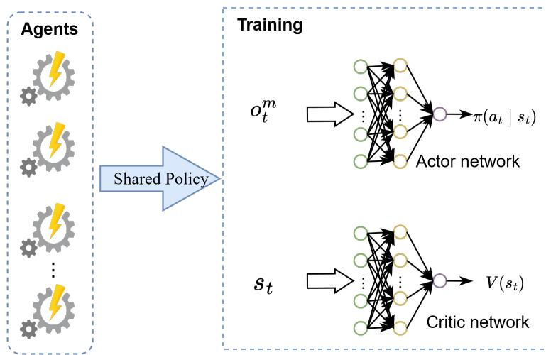
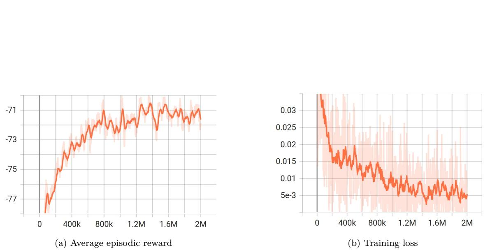
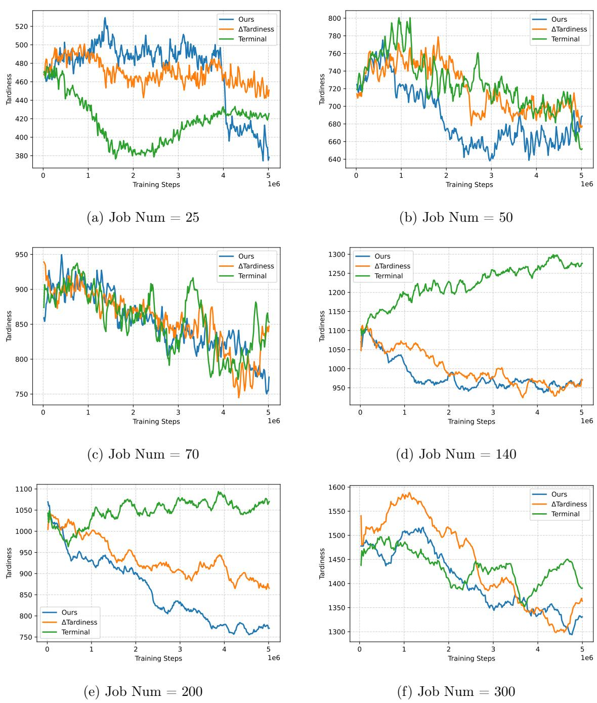

Machine-Aligned Multi-Agent Reinforcement Learning for Dynamic Flexible Job Shop Scheduling

# Abstract

Multi-agent reinforcement learning (MARL) has emerged as a promising paradigm for the Dynamic Flexible Job Shop Scheduling Problem (DFJSP) due to its adaptability and decentralized decision-making. With agent behaviors being unpredictable and the global reward ambiguous, current MARL methods face the challenges of nonstationarity and credit assignment. To address these, we propose a machine-aligned MARL framework for the DFJSP with stochastic job arrivals. An abstract stateaction representation, augmented with priority dispatching rules (PDRs), renders heterogeneous machines logically homogeneous, thereby enabling a unified policy that yields more coordinated behavior. A dense local reward signal combines sparse, unbiased tardiness variations with dense slack values that reflect potential tardiness, yielding a hybrid measure that integrates both realized outcomes and predictive information. Experiments demonstrate that our approach consistently reduces total tardiness by 25.09% compared with classical dispatching rules and by $2 2 . 3 1 \%$ compared with RL baselines on average across scenarios, achieving robust online scheduling performance. Furthermore, extensive validation confirms that the proposed reward exhibits a strong and statistically significant negative correlation with total tardiness, thereby ensuring its alignment with the scheduling objective.

Keywords: Dynamic Flexible Job Shop Scheduling, Multi-Agent Reinforcement Learning, Priority Dispatching Rules, Credit Assignment, Tardiness Minimization, Online Scheduling

# 1. Introduction

The Dynamic Flexible Job Shop Scheduling Problem (DFJSP) is characterized by numerous dynamic events, such as machine breakdowns, urgent order insertions, stochastic job arrivals and other uncertainties. Such complex environments present difficulties for traditional offline optimization methods, including heuristics and metaheuristics, which adapt poorly and incur substantial computational overhead [1, 2]. To overcome these limitations, multi-agent reinforcement learning (MARL) has emerged as a powerful data-driven framework. By combining the adaptive decision-making of reinforcement learning (RL) with the decentralized coordination of multi-agent systems (MAS), MARL is particularly well-suited to deliver the flexible, high-quality scheduling decisions necessary for shop-floor operations.

In prior work, MARL for DFJSP is commonly framed with heterogeneous agents, where machines and jobs constitute distinct roles with asymmetric observations and heterogeneous action spaces (routing vs. sequencing), operating under event-driven, asynchronous decisions and dynamically changing action sets [3, 4, 5, 6]. Such heterogeneity exacerbates non-stationarity, as the policy updates of one agent alter the decision environment of others, thereby leading to unstable learning dynamics [7, 6]. While centralized training with decentralized execution (CTDE) [1] and alternating training [8, 9] are widely used to mitigate these effects,these strategies only partially alleviate non-stationarity, as policy coupling and coordination overhead persist in heterogeneous systems [7]. Equally fundamental is credit assignment [10]. Global objectives such as total tardiness are sparse and delayed, with long-horizon interdependencies whereby early routing decisions influence downstream operations and due-date compliance[11, 12, 13]. Principled remedies like counterfactual baselines [14] face prohibitive costs as the joint action space and team size grow, especially under dynamic action availability. Consequently, many studies resort to heuristic reward shaping for denser feedback [1, 3], but designing signals that are fair across heterogeneous roles and aligned with global goals remains challenging. Taken together, agent heterogeneity and global, delayed objectives jointly give rise to non-stationarity and credit assignment—two persistent obstacles for MARL in DFJSP.

To address these challenges, we propose a machine-aligned MARL framework for the DFJSP with stochastic job arrivals. In this framework: (i) Non-stationarity is alleviated through a priority dispatching rule (PDR)-assisted abstract state-action representation, which makes physically heterogeneous machines logically homogeneous and enables them to share a unified policy. This promotes more consistent agent behavior and reduces the instability caused by evolving policies; (ii) Credit assignment problem is mitigated by designing a dense local reward signal that combines unbiased but sparse changes in tardiness with dense slack values reflecting potential future tardiness. This hybrid measure integrates realized outcomes with predictive information, providing timely and informative feedback that links individual actions to global objectives.

# The main contributions of this work are summarized as follows:

• We propose a machine-aligned MARL framework for dynamic flexible job shop scheduling with stochastic job arrivals. Our approach treats heterogeneous machines as logically homogeneous, enabling policy sharing to mitigating nonstationarity. Furthermore, a dense local reward is employed to alleviate the credit assignment issues.

• We achieve this homogeneity via a PDR-assisted abstract state-action representation that unifies machine observations and actions. The dense local reward combines realized tardiness changes with predictive slack values, supporting coordinated decision-making. • Extensive experiments demonstrate that our approach achieves robust and high-quality online scheduling, consistently outperforming classical dispatching rules and RL baselines across various dynamic scenarios.

The remainder of this paper is organized as follows: Section 2 reviews the related work on DFJSP and reinforcement learning-based scheduling methods. Section 3 formulates the DFJSP. Section 4 details the proposed machine-aligned MARL framework, including the MDP design, state and action representations, and the reward mechanism. Section 5 presents the experimental setup, benchmark comparisons, and performance analysis. Finally, Section 6 summarizes the work and outlines future research directions.

# 2. Related Work

The growing demand for customized and responsive manufacturing has intensified research into the DFJSP, a complex and dynamic variant of classical scheduling problems. Addressing the DFJSP is critical for improving production efficiency, reducing operational costs, and enhancing the robustness of modern manufacturing systems [15]. Over the past decades, a wide range of approaches have been proposed, including heuristic [16, 17], metaheuristic [18, 19, 20, 21, 22, 23], and reinforcement learning-based methods [1, 8, 15, 3, 24, 25, 26]. Among these, multi-agent reinforcement learning (MARL) has recently emerged as a promising framework for modeling the decentralized and asynchronous characteristics of the DFJSP.

# 2.1. Heuristic and Metaheuristic Algorithms for DFJSP

Early research on DFJSP primarily employed heuristic methods to construct nearoptimal schedules under dynamic conditions [17]. Simple dispatching rules—such as shortest processing time (SPT), earliest due date (EDD), and minimum slack (MS)—are widely adopted due to their computational efficiency and responsiveness to real-time events [27]. Despite these advantages, rule-based strategies are inherently myopic and problem-specific, often failing to achieve globally optimized solutions [28, 29, 30].

To address these limitations, metaheuristic algorithms have been extensively explored. Representative techniques include genetic programming (GP) [18, 19, 20], particle swarm optimization (PSO) [21, 22], and ant colony optimization (ACO) [23]. By leveraging population-based or probabilistic search mechanisms, these methods are capable of navigating large, complex solution spaces and handling the multiobjective, combinatorial nature of DFJSP. They have been particularly effective in rescheduling strategies that adapt to disruptions either periodically or in an eventtriggered manner.

Nevertheless, metaheuristic approaches still face significant challenges in highly dynamic environments. Frequent rescheduling leads to substantial computational overhead, making real-time responsiveness difficult to achieve [31]. Their reliance on extensive parameter tuning and lack of online learning capabilities further limits adaptability in continuously evolving production settings [32]. Although learningbased enhancements (e.g., reinforcement learning integration) improve search intelligence, they do not fundamentally change the paradigm of metaheuristics, which remains rooted in iterative population[33] or trajectory-based[34, 35] exploration. This inherently incurs repeated solution evaluations, while neural network inference introduces additional decision costs. As a result, these approaches still struggle to achieve real-time responsiveness, and their centralized learning components hinder scalability in large, decentralized manufacturing systems.

# 2.2. Single-Agent Reinforcement Learning for DFJSP

The limitations of traditional scheduling techniques have a led to growing interest in RL, which enables agents to learn scheduling policies autonomously through interaction with dynamic environments. RL offers the potential to address both the computational inefficiencies of rescheduling and the adaptability limitations of handcrafted strategies [36].

Single-agent reinforcement learning (SARL) methods model the scheduling problem as a Markov Decision Process (MDP), where a centralized agent observes the global system state and makes composite scheduling decisions involving job sequencing and machine allocation [37]. Approaches based on deep Q-networks (DQN) [38, 39, 40], deep deterministic policy gradients (DDPG) [41], and proximal policy optimization (PPO) [42] have demonstrated the ability to learn adaptive scheduling strategies without relying on handcrafted rules.

However, SARL methods typically rely on centralized decision-making, which becomes problematic as the system scales[43]. The agent must manage increasingly high-dimensional state and action spaces, resulting in greater computational burdens and reduced scalability in large-scale or highly dynamic environments [44].

# 2.3. Multi-Agent Reinforcement Learning for DFJSP

To address the scalability and centralization bottlenecks of single-agent approaches, multi-agent reinforcement learning (MARL) has been applied to DFJSP by modeling machines, jobs, or operations as autonomous agents [45, 3, 4, 5, 6]. This decentralized paradigm suits the distributed setup of job shops and enables the system to adapt flexibly to dynamic events[46, 45]. Although several architectures—such as graph neural networks (GNN) [47, 5, 6] and the centralized training with decentralized execution (CTDE) [11] framework—have been explored, MARL still faces two intrinsic challenges that critically hinder its effectiveness in DFJSP: non-stationarity and credit assignment.

The non-stationarity problem stems from the fact that each agent’s environment changes as other agents simultaneously update their policies. From the perspective of a single machine, state transitions and rewards are no longer stationary but shift with the scheduling behavior of other agents [48, 7, 11, 49]. This issue is particularly severe in DFJSP, where stochastic job arrivals, machine breakdowns, and evolving action sets continuously reshape the environment [36]. As a result, a decision that was optimal under one policy configuration may instantly become suboptimal once other machines adapt their strategies, leading to unstable or even divergent learning [50, 51]. Although approaches such as opponent modeling [52, 53, 54, 55] and distributed value-based methods [56, 48, 47] have been proposed, they still have significant limitations in DFJSP: opponent modeling suffers from poor scalability in large-scale real-time scheduling scenarios [57, 58], and distributed value-based methods may face convergence challenges in highly dynamic scheduling environments [59, 60, 61]. These shortcomings make non-stationarity a key obstacle to deploying MARL in dynamic scheduling.

Equally fundamental is the credit assignment problem, which arises because agents usually receive only sparse, delayed global rewards–such as makespan or total tardiness [62]. In DFJSP, this means the system can evaluate performance only after all jobs are completed, making it extremely difficult to attribute success or failure to individual machine decisions [63]. Simply distributing the global reward among all agents risks penalizing good decisions and rewarding poor ones, thereby misleading policy learning [64]. Although value decomposition methods [48, 7, 49] and counterfactual baselines [14] have been developed to address the credit assignment issue, they remain severely challenged in large-scale DFJSP environments. Their effectiveness is hampered by the combinatorial explosion of the joint action space, the prohibitive computational cost of evaluating counterfactuals [65], and—most critically— the persistently sparse and delayed nature of the global reward signal in long-horizon scheduling problems [66], which tends to undermine learning efficiency and may lead to slow convergence. Consequently, recent studies have applied experience-based reward shaping [1, 3, 8, 45]. However, such methods often fail to capture delayed and inter-agent dependencies that span long temporal horizons–dependencies that are critical for accurately attributing outcomes in dynamic scheduling environments.

# 2.4. Summary

In summary, while heuristic and metaheuristic approaches offer simplicity and generality, they lack adaptability and real-time responsiveness. MARL offers scalability for DFJSP but is still hampered by non-stationarity and credit assignment. Consequently, we propose a machine-aligned MARL framework that enables policy sharing among logically homogeneous agents and introduces a composite reward function that combines realized tardiness with predictive slack information, tailored for stochastic job arrivals.

# 3. Problem Formulation

For a comprehensive reference, the symbols used throughout this paper are defined in Table 1.

The DFJSP with stochastic job arrivals considered in this study, is defined as follows. A set of $n$ jobs $J = \{ J _ { 1 } , J _ { 2 } , \dots , J _ { n } \}$ arrives over time and must be scheduled on a set of $m$ machines $M = \{ M _ { 1 } , M _ { 2 } , . . . , M _ { m } \}$ . Each job $J _ { i }$ consists of $N _ { i }$ operations, where $O _ { i , j }$ denotes the $j$ - $^ { t h }$ operation of job $J _ { i }$ . Each operation $O _ { i , j }$ can be processed on any machine $M _ { k }$ from its predefined set of compatible machines $M _ { i , j } \subseteq M$ . The processing time of operation $O _ { i , j }$ on machine $M _ { k }$ is represented by $t _ { i , j , k }$ . Each job $J _ { i }$ is associated with an arrival time $a _ { i }$ , a due date $d _ { i }$ , and a completion time $C _ { i }$ . The objective of the problem is to minimize the total tardiness of all jobs. To ensure feasibility, the following predefined constraints must be satisfied.

(1) Machine exclusivity: At any time, each machine can process at most one operation.   
(2) Precedence constraint: The operations within a given job must be executed in a strictly predefined order; an operation cannot begin until its immediate predecessor is complete.   
(3) Non-preemptive processing: Once an operation begins execution on a machine, it must run to completion without interruption.   
(4) Negligible transition times: The transfer times of workpieces between machines, machine setup times, and decision-making times are assumed to be negligible and are excluded from the model.

Based on the preceding problem definition, constraints, assumptions and notations, the mathematical model is formulated as follows.

$$
\operatorname { M i n i m i z e } \sum _ { i = 1 } ^ { n } \operatorname* { m a x } \{ C _ { i } - d _ { i } , 0 \}
$$

Subject to:

$$
C _ { i , j , k } > S _ { i , j , k }
$$

$$
S _ { i , j , k } \geq C _ { i , j - 1 , k ^ { \prime } }
$$

$$
\sum _ { k \in M _ { i , j } } X _ { i , j , k } = 1 , \quad \forall i = 1 , \dots , n , j = 1 , \dots , n _ { i }
$$

$$
\begin{array} { r } { \cdot \left( S _ { i , j , k } , S _ { i ^ { \prime } , j ^ { \prime } , k } \right) \geq \operatorname* { m i n } \big ( C _ { i , j , k } , C _ { i ^ { \prime } , j ^ { \prime } , k } \big ) , \forall ( i , j ) \neq ( i ^ { \prime } , j ^ { \prime } ) , \forall k \mathrm { ~ s . t . ~ } X _ { i , j , k } = X _ { i ^ { \prime } , j ^ { \prime } , k } = } \end{array}
$$

Equation (1) defines the objective function, which minimizes the total tardiness of all jobs. Equation (2) ensures that each job’s completion time does not precede its start times. Equation (3) enforces the sequential processing of operations within each job. Furthermore, Equation (4) and Equation (5) specify that each operation must be assigned to exactly one machine and that each machine can process at most one operation concurrently, respectively.

# 4. Methodology

# 4.1. Event-Driven Decision Process

We adopt an event-driven decision process, where decisions are triggered only when a machine becomes idle and there are available jobs to schedule, rather than at every shop state change such as job arrivals or operation completions. At each event time, we identify the set of machines that have become idle.

Activation mechanism. If a single machine becomes idle, it is immediately activated to make a scheduling decision. If multiple machines become idle simultaneous, their activations are resolve sequentially. Specifically, machines are ordered by their release times, with earlier-finishing machines having priority over later-finishing ones. When two or more machines are released simultaneously (due to simulation discretization), we randomly select among them. This mechanism reflects the natural “first-come, first-served” priority in real systems, while introducing randomness only when machines are indistinguishably simultaneous.

Table 1: The definition of symbols.   

<table><tr><td>SymbolsDefinition</td><td></td></tr><tr><td>t</td><td>current time step</td></tr><tr><td>n</td><td>The number of jobs</td></tr><tr><td>m</td><td>The number of machines</td></tr><tr><td>Ji</td><td>The i-th job</td></tr><tr><td>Mk</td><td>The k-th machine</td></tr><tr><td>Ni</td><td>The operation num of Ji</td></tr><tr><td>Oi,j</td><td>The j-th operation of the i-th job</td></tr><tr><td>Mi,j</td><td> set of machines capable of processing operation Oi,j</td></tr><tr><td>Si,jk</td><td>The start time of Oij on Mk</td></tr><tr><td>Cijk</td><td>The completion time of Oi,j on Mk</td></tr><tr><td>Ci</td><td>The completion time of Ji</td></tr><tr><td>ai</td><td>The arrival time of Ji</td></tr><tr><td>di</td><td>The due date for job Ji</td></tr><tr><td>pti</td><td>The processed time of Ji</td></tr><tr><td>rpti</td><td>Remaining processing time of Ji</td></tr><tr><td>roni</td><td>Remaining operations of Ji</td></tr><tr><td>Xi,jk</td><td>{1， if Oi,j is assigned to Mκ 0, otherwise</td></tr></table>

Sequential resolution within an event. Following the established activation order, we activate one idle machine at a time, construct the set of feasible operations, and query the decision policy to select an action. Once an operation is assigned, the system state is updated, which may remove candidate options for the remaining idle machines. This process continues until no idle machines require a decision at event time $t _ { k }$ , after which physical time advances to the next event $t _ { k + 1 }$ . This approach preserves the inherent parallelism of shop-floor execution while using sequential decision process within the simulation to prevent artificial conflicts or unnecessary delays.

Complexity and real-time feasibility. At each event, the set of idle machines can be collected in $O ( m )$ time, where $m$ denotes the number of machines. Tiebreaking requires at most $O ( | I _ { k } | )$ operations, with $\left| I _ { k } \right|$ denoting the number of idle machines at event time $t _ { k }$ . The scheduling policy is queried once for each activated machine, resulting in an overall computational complexity of $O ( m )$ . In practice, policy inference is executed within the millisecond range, which is negligible compared to job processing times and therefore does not affect tardiness beyond the assignments determined by the policy.

# 4.2. Event-Driven Single-Chain MDP Formulation

We now formalize the event-driven sequential activation mechanism within a MARL framework under CTDE.

State and observations.. At each event time $t _ { k }$ , the environment state $s _ { k } \in S$ encodes all relevant global information. During training, the critic has full access to $s _ { k }$ , while during execution each machine $m$ receives only a local observation $o _ { k } ^ { m } \in \mathcal { O }$ containing its own status and available operations.

Action.. When an event occurs, the activation mechanism described in Section 4.1 selects one idle machine $m \in { I _ { k } }$ as the active agent. The agent’s policy then maps its local observation $o _ { k } ^ { m }$ to an action $a _ { k } ^ { m } \in \mathcal { A } ^ { m }$ , which corresponds to assigning an admissible operation. Although execution is decentralized, all agents share parameters to enable efficient learning.

Transition dynamics.. At each micro-step, one idle machine $m$ that requires a decision is activated to execute an action $a _ { k } ^ { m }$ , which updates the system state by modifying the job and machine queues and assigning the selected operation to $m$ . This process continues until all decision-required idle machines at time $t _ { k }$ have completed their choices. Only then does the system advance to the next event time $t _ { k + 1 }$ , determined by the earliest job arrival or operation completion. In this way, machine decisions are resolved sequentially in a single decision chain, while temporal evolution remains event-driven and preserves the physical parallelism of the shop floor.

Reward.. Each transition $\left( { { s _ { k } } , { a _ { k } ^ { m } } , { s _ { k + 1 } } } \right)$ yields a scalar reward $r _ { k }$ , reflecting the objective of minimizing cumulative job tardiness. Rewards are shared across agents to align their incentives. The specific design of $R$ will be detailed in Section 4.5.

MDP formulation.. The event-driven scheduling problem is therefore modeled as a single-chain MARL problem under CTDE, formally defined as follows:

$$
\mathcal { M } = ( \mathcal { S } , \{ \mathcal { O } ^ { m } \} _ { m = 1 } ^ { M } , \{ \mathcal { A } ^ { m } \} _ { m = 1 } ^ { M } , P , R , \gamma )
$$

Here $\boldsymbol { S }$ denotes the global state space; ${ \mathcal { O } } ^ { m }$ and $\mathcal { A } ^ { m }$ denote the observation and action spaces for agent $m$ ; $P$ is the transition kernel induced by job arrivals and operation completions, $R$ is the reward, and $\gamma$ is the discount factor. The singlechain activation ensures that despite decentralized execution, the process can be modeled as a well-defined MDP.

# 4.3. Observation and State Design

In the proposed CTDE framework, we distinguish between the local observation available to the actor and the global state provided to the critic. The former captures the limited decision-making context of a single activated machine, while the latter augments this information with global scheduling statistics to stabilize value estimation.

(a) Local Observation (45 dimensions).. The local observation encodes the features of candidate jobs available to the activated machine. To ensure informative yet compact representations, we extract features from the top-ranked job under each of five priority dispatching rules (PDRs). Let the rule set be $R = \left\{ R _ { 1 } , R _ { 2 } , R _ { 3 } , R _ { 4 } , R _ { 5 } \right\}$ , and let $J ^ { R _ { i } }$ denote the job selected by rule $R _ { i }$ . The feature vector of each selected job is denoted by $f ( J ^ { ( R _ { i } ) } ) \in \mathbb { R } ^ { 9 }$ , which consists of:

• Progress ratio:

$$
P R = { \frac { N _ { i } - \mathrm { r o n } _ { i } } { n _ { i } } }
$$

• Average processing speed:

$$
A P S = { \frac { p t _ { i } } { t - a _ { i } + \varepsilon } }
$$

• Remaining due ratio:

$$
R D R = { \frac { \operatorname* { m a x } ( d _ { i } - t , 0 ) } { d _ { i } - a _ { i } + \varepsilon } }
$$

• Tightness:

$$
T I G = \operatorname* { m i n } \left( \frac { r p t _ { i } } { d _ { i } - t + \varepsilon } , 1 . 0 \right)
$$

• Rule encoding (5 dimensions): A one-hot vector indicating representing the rule that selected the job. For example, if a job was selected by the first rule, the encoding is $[ 1 , 0 , 0 , 0 , 0 ]$ .

Thus, the local observation vector is defined as follows:

$$
o _ { t } ^ { m } = [ f ( J ^ { ( R _ { 1 } ) } ) , f ( J ^ { ( R _ { 2 } ) } ) , f ( J ^ { ( R _ { 3 } ) } ) , f ( J ^ { ( R _ { 4 } ) } ) , f ( J ^ { ( R _ { 5 } ) } ) ] \in \mathbb { R } ^ { 4 5 }
$$

(b) Global State (55 dimensions).. The global state augments the local observation with overall scheduling context. Specifically, we compute urgency statistics over the set of all unscheduled jobs $U _ { t } = \{ u _ { 1 } , u _ { 2 } , . . . , u _ { n } \}$ .

$$
u _ { i } = \operatorname* { m i n } \left( \frac { r p t _ { i } } { \operatorname* { m a x } ( d _ { i } - t , \varepsilon ) } , 1 . 0 \right) .
$$

The global scheduling features (10 dimensions) are given by:

• Urgency values of PDR-selected jobs:

$$
u ( J ^ { ( R _ { 1 } ) } ) , u ( J ^ { ( R _ { 2 } ) } ) , u ( J ^ { ( R _ { 3 } ) } ) , u ( J ^ { ( R _ { 4 } ) } ) , u ( J ^ { ( R _ { 5 } ) } )
$$

• Overall statistics:

– Mean urgency:

$$
\mu _ { u } = \frac { 1 } { n } \sum _ { i = 1 } ^ { n } u _ { i }
$$

– Standard deviation:

$$
\sigma = \sqrt { \frac { 1 } { n } \sum _ { i = 1 } ^ { n } ( u _ { i } - \mu _ { u } ) ^ { 2 } }
$$

$-$ Maximum and minimum urgency:

$$
\operatorname* { m a x } ( U _ { t } ) , \operatorname* { m i n } ( U _ { t } )
$$

– Proportion of jobs with an urgency level of $1$ :

$$
P O U = \frac { 1 } { n } \sum _ { i = 1 } ^ { n } \mathbb { I } ( u _ { i } = 1 )
$$

We denote the global feature vector as:

$$
s ^ { g l o b a l } \in \mathbb { R } ^ { 1 0 }
$$

Finally, the critic state is formed by concatenating the local observation and the global features:

$$
s _ { t } = \left[ o _ { t } ^ { m } , s _ { t } ^ { g l o b a l } \right] \in \mathbb { R } ^ { 5 5 }
$$

# 4.4. Action Design

From the perspective of a machine agent, the most intuitive action is to select a job directly for processing. However, in practical scheduling scenarios, the number of candidate jobs varies dynamically across machines and time steps, resulting in a variable-sized action space. Although this direct action method is straightforward, it applies only to scheduling problems with a fixed or small number of jobs and machines. This contradicts the objective of this study, which targets dynamic scheduling environments with arbitrary numbers of jobs and machines.

To reduce the action space while maintaining flexibility, we employ a rule-assisted candidate generation mechanism. At each decision point, a predefined set of priority dispatching rules (PDRs) is applied to the current jobs, and each rule independently selects its top-priority job. The resulting set of candidate jobs is then presented to the agent, which selects one job from this set for scheduling. This approach simplifies the action space while preserving flexibility and generalization across dynamic scheduling environments.

In our implementation, we utilize five classical and widely used PDRs: Earliest Due Date (EDD), Critical Ratio (CR), Slack per Operation (SRO),Shortest Processing Time (SPT) and Minimum Slack (MS). At each decision point, all predefined dispatching rules are applied in parallel to the set of available jobs. Each rule selects the top-ranked job according to its priority criterion, resulting in a small pool of representative jobs. The features of these jobs are extracted to form a partial observation, based on which the agent makes the final decision by selecting one job for processing. The mathematical definitions and operational logic of the considered PDRs are summarized in Table 2.

# 4.5. Reward Design

Building upon the Single-Chain MDP introduced in Section 4.2, our framework avoids the classical credit assignment problem in MARL. In this setup, only one agent makes a scheduling decision at a time, allowing the environment to assign a reward that reflects the outcome of that action. Our primary objective is to minimize total job tardiness. However, tardiness can be computed only after a job has completed all its operations, resulting in a delayed and sparse reward signal that provides limited guidance during learning.

Table 2: Summary of Priority Dispatching Rules (PDRs)   

<table><tr><td>ID</td><td>Rule</td><td>Logic</td></tr><tr><td>0</td><td>EDD</td><td>Select job with the earliest due date</td></tr><tr><td>1</td><td>CR</td><td>CRi = di-t Select job with minimum CRi rpti</td></tr><tr><td>2</td><td>SRO</td><td>d-t-rpti Select job with minimum SROi SROi = roni</td></tr><tr><td>3</td><td>ATC</td><td>ATCi 1 exp max(di-t-rpti,0)) Select job with pti,j k·pt maximum ATCi</td></tr><tr><td>4</td><td>MS</td><td>Selects the job with the least slack time.</td></tr><tr><td>5</td><td>FIFO</td><td>Select job that arrived earliest</td></tr><tr><td>6</td><td>SPT</td><td>Select job with the shortest processing time</td></tr><tr><td>7</td><td>LPT</td><td>Select job with the longest processing time</td></tr><tr><td>8</td><td>LRPT</td><td>Job with the longest total remaining processing time</td></tr><tr><td>9</td><td>SRPT</td><td>Job with the shortest total remaining processing time</td></tr></table>

To provide more immediate feedback, we introduce job slack time as a supplementary metric. Slack time measures the time remaining before a job’s due date relative to its estimated remaining processing time. It can be computed at each decision step and serves as a proxy for urgency and scheduling pressure. By incorporating the negative slack rate—the proportion of jobs currently in a time-deficient state—into the reward, the agent receives timely feedback on the system’s urgency landscape, alleviating reward sparsity and improving learning efficiency.

It is important to note the distinction: slack time provides early warnings about potential tardiness, allowing the agent to proactively prioritize at-risk jobs, whereas tardiness reflects actual delays and serves as the ultimate performance metric.

At each decision step $t$ , the raw reward is defined as:

$$
r _ { t } = - ( \lambda \cdot \Delta T _ { t } + n s r _ { t } )
$$

where $\lambda$ is a weighting factor, $\Delta T = T _ { t } - T _ { t - 1 }$ is the increase in cumulative job tardiness after the current decision, and $n s r _ { t } \in [ 0 , 1 ]$ represents the proportion of

unscheduled jobs with negative slack time, indicating the urgency level of the system.

The cumulative tardiness $T _ { t }$ is computed as:

$$
T _ { t } = \sum _ { j \in \mathcal { I } _ { t } ^ { \mathrm { d o n e } } } \operatorname* { m a x } \left( C _ { j } - d _ { j } , 0 \right)
$$

where ${ \mathcal { I } } _ { t } ^ { \mathrm { d o n e } }$ denotes the set of completed jobs at time $t$ , $C _ { j }$ is the completion time of job $j$ , and $d _ { j }$ is its due date.

The slack time of job $i$ at time $t$ is defined as:

$$
s t _ { i } ( t ) = d _ { i } - t - r p t _ { i }
$$

Based on this, the negative slack rate is calculated as:

$$
n s r _ { t } = \frac { 1 } { n _ { t } } \sum _ { i = 1 } ^ { n _ { t } } \mathbb { I } \left( s _ { i } ( t ) < 0 \right)
$$

Let $n _ { t }$ be the number of jobs that have arrived and are not yet completed at time $t$ .

To stabilize training and reduce the impact of large reward magnitudes, we apply a logarithmic transformation to the raw reward:

$$
\hat { r } _ { t } = - l o g ( 1 - r _ { t } )
$$

This transformation compresses extreme values while preserving the reward sign, there by improving numerical stability and making it more suitable for gradientbased optimization.

The event-driven formulation converts the multi-agent scheduling process into a single-chain MDP, enabling training with a standard single-agent policy optimization framework under the CTDE paradigm. The actor conditions only on the local observation of the currently activated machine, while the critic estimates state values from the global system state. An overview of the event-driven PPO pipeline under CTDE is shown in Figure 1.

Let $\pi _ { \boldsymbol { \theta } } ( a _ { t } | _ { O _ { t } } )$ and $V _ { \phi } ( s _ { t } )$ denote the policy with parameters $\theta$ and the value function with parameters $\phi$ . We optimize the clipped surrogate objective

$$
L ^ { \mathrm { P P O } } ( \theta ) = \mathbb { E } _ { t } \Big [ \operatorname* { m i n } \Big ( \rho _ { t } ( \theta ) \hat { A } _ { t } , \ \mathrm { c l i p } ( \rho _ { t } ( \theta ) , 1 - \epsilon , 1 + \epsilon ) \hat { A } _ { t } \Big ) \Big ] ,
$$

where the probability ratio is

$$
\rho _ { t } ( \theta ) = \frac { \pi _ { \theta } ( a _ { t } | s _ { t } ) } { \pi _ { \theta _ { \mathrm { o l d } } } ( a _ { t } | s _ { t } ) } ,
$$

and the advantage estimate is computed with generalized advantage estimation (GAE):

$$
\hat { A } _ { t } = \sum _ { l = 0 } ^ { T - t - 1 } ( \gamma \lambda ) ^ { l } \delta _ { t + l } , \quad \delta _ { t } = R _ { t } + \gamma V _ { \phi } ( s _ { t + 1 } ) - V _ { \phi } ( s _ { t } ) ,
$$

where $R _ { t }$ is the immediate reward.

The critic is updated by minimizing the squared error between the predicted and empirical returns:

$$
L ^ { \mathrm { v a l u e } } ( \phi ) = \mathbb { E } _ { t } \Big [ \big ( V _ { \phi } ( s _ { t } ) - \hat { R } _ { t } \big ) ^ { 2 } \Big ] , \qquad \hat { R } _ { t } = \sum _ { l = 0 } ^ { T - t - 1 } \gamma ^ { l } R _ { t + l } .
$$

The overall objective combines the policy surrogate, the value loss, and an entropy regularizer:

$$
L ( \theta , \phi ) = L ^ { \mathrm { P P O } } ( \theta ) + c _ { v } L ^ { \mathrm { v a l u e } } ( \phi ) - c _ { e } \mathbb { E } _ { t } \bigl [ \mathcal { H } ( \pi _ { \theta } ( \cdot \mid o _ { t } ) ) \bigr ] ,
$$

During training, all machines share the same policy parameters. Experiences collected from different decision events are stored in a unified on-policy buffer and jointly used to update both the actor and the critic (Figure 1). At each scheduling event, the active machine is selected according to the activation mechanism in Algorithm 2. The selected machine encodes its local observation into a state representation (Algorithm 3) and samples an action from the shared policy. This sequential sampling preserves the event-driven nature of the environment while ensuring consistency in the collected training data. The overall PPO training procedure is summarized in Algorithm 1.

Because the event-driven formulation results in a single-chain MDP, training can be performed using a single agent. The learned policy is then deployed across all machines through parameter sharing, as illustrated in Figure 2. This approach is justified because all machines are homogeneous, and the single-chain MDP already captures the behavior of any activated machine. As a result, policy trained with a single agent is sufficient, while decentralized execution naturally emerges from sharing the trained parameters among all machines.

To evaluate training stability, we monitor the episode reward and the total training loss during the PPO optimization process (Figure 3). The episode reward curve shows steady improvements in scheduling performance over time, while the training loss gradually decreases and remains bounded, indicating that the shared policy and value networks are being optimized reliably.

  
Figure 1: Decentralized execution with a shared policy. After training, the single, optimized policy is deployed across all homogeneous machines. Each machine then independently uses this shared policy to make scheduling decisions based on its own local observation, without the need for interagent communication.

  
Figure 2: Decentralized execution via parameter sharing. The learned policy is shared among all machines, enabling them to make autonomous decisions based on their local views.

  
Figure 3: Training performance of our method on the 25-job instance.

1: Initialize shared policy $\pi _ { \theta }$ and value function $V _ { \phi }$   
2: for each training iteration do   
3: Initialize empty buffer $\mathcal { D }$   
4: for each episode do   
5: Reset environment   
6: while not terminal do   
7: m ← SelectReadyMachine(M, J ready) $\triangleright$ See Algorithm 2   
8: $s _ { t } , o _ { t } ^ { m } \gets \mathrm { C O N S T R U C T S T A T E } \big ( m , \mathcal { T } ^ { \mathrm { r e a d y } } , R \big )$ $\triangleright$ See Algorithm 3   
9: Generate candidate actions via PDRs   
10: Select action $a _ { t } ^ { m } \sim \pi _ { \theta } ( a _ { t } ^ { m } | o _ { t } ^ { m } )$   
11: $m$ Execute $a _ { t }$ , observe $r _ { t }$   
12: Store $\left( s _ { t } , o _ { t } ^ { m } , a _ { t } ^ { m } , r _ { t } \right)$ in $\mathcal { D }$   
13: end while   
14: end for   
15: Compute advantage estimates ${ \hat { A } } _ { t }$   
16: Update $\theta$ , $\phi$ using PPO loss on $\mathcal { D }$   
17: end for   
1: Input: Machine set $\mathcal { M }$   
2: Output: A machine $m _ { \mathrm { s e l e c t e d } }$ to be activated   
3: Initialize ${ \mathcal { M } } ^ { \mathrm { i d l e } } \gets \{ m \in { \mathcal { M } } \ | \ m \ \mathrm { i s \ i d l e } \}$   
4: if $\mathcal { M } ^ { \mathrm { i d l e } } = \emptyset$ then   
5: return None   
6: end if   
7: Compute release time $r _ { m }$ for each $m \in \mathcal { M } ^ { \mathrm { i d l e } }$ (time when $m$ became idle)   
8: Find minimum release time $r _ { \mathrm { m i n } } = \operatorname* { m i n } _ { m \in \mathcal { M } ^ { \mathrm { i d l e } } } r _ { m }$   
9: Let $\mathcal { M } ^ { \mathrm { m i n } }  \{ m \in \mathcal { M } ^ { \mathrm { i d l e } } \mid r _ { m } = r _ { \mathrm { m i n } } \}$   
10: if $| \mathcal { M } ^ { \mathrm { m i n } } | = 1$ then   
11: mselected ← the unique machine in Mmin   
12: else   
13: Randomly select $m _ { \mathrm { s e l e c t e d } } \in \mathcal { M } ^ { \mathrm { m u n } }$   
14: end if   
15: return mselected   
Algorithm 3 ConstructState: Build the state representation for machine $m$   
1: Input: Machine $m$ , ready job set $\mathcal { I } ^ { \mathrm { r e a d y } }$ , rule set $R = \{ R _ { 1 } , . . . , R _ { 5 } \}$   
2: Output: State vector $s _ { t } \in \mathbb { R } ^ { 5 5 }$   
3: Initialize empty set $\mathcal { J } _ { \mathrm { a v a i l a b l e } } ^ { m }  \emptyset$   
4: for each job $j \in \mathcal { I } ^ { \mathrm { r e a d y } }$ do   
5: if $j$ can be processed on $m$ then   
6: Add $j$ to $\mathcal { I } _ { \mathrm { a v } \mathrm { : } } ^ { m }$ ailable   
7: end if   
8: end for   
9: Initialize empty list LocalFeatures $ [ ]$   
10: for eac11: Use ule to $R _ { i } \in R$ dobs in ailable   
$R _ { i }$ $\mathcal { I } _ { \mathrm { a v } \varepsilon } ^ { m }$   
12: Select top-1 job $j ^ { ( R _ { i } ) }$   
13: Extract feature vector $f ( j ^ { ( R _ { i } ) } ) \in \mathbb { R } ^ { 9 }$   
14: Append $f ( j ^ { ( R _ { i } ) } )$ to LocalFeatures   
15: end for   
16: Compute global scheduling features $s _ { t } ^ { \mathrm { g l o b a l } } \in \mathbb { R } ^ { 1 0 }$   
17: Concatenate all features: $s _ { t } \gets [ \mathrm { L o c a l F e a t u r e s } , ~ s _ { t } ^ { \mathrm { g l o b a l } } ]$ , sglobalt ]   
18: return $s _ { t }$

# 5. Experiments

# 5.1. Experimental Setup

Problem Setting. We consider a DFJSP with 10 machines. Job sizes are set to $\{ 2 5 , 5 0 , 7 0 , 1 4 0 , 3 0 0 \}$ . For each environment, 20 distinct job types are instantiated to form the job pool. Initially, 10 jobs are sampled with replacement as the released jobs, while the remaining jobs arrive dynamically following a Poisson process with a rate $\lambda = 0 . 5$ . All machines share identical processing times for the same operation, thus isolating scheduling effects from machine-dependent variations.

Evaluation Metric. The primary performance indicator is total tardiness, defined as the sum of job tardiness upon completion across all jobs.

Baselines. We design two groups of comparative experiments:

• Comparison with PDRs: Our approach is compared with several classical priority dispatching rules listed in table 2.   
• Comparison with RL-based methods: We benchmark against representative RL algorithms that have been applied to the DFJSP, including CSR-DDQN [38], DHMARL [3], and CA-DDPG [41].

Since these studies rely on heterogeneous agent designs and lack publicly available implementations, direct reproduction is infeasible. To ensure fairness, we reimplement their algorithms in our environment, preserving our asynchronous decisionmaking logic, state representation, and dynamics, while substituting PPO with their respective models.

Implementation Details. All methods are implemented in Python 3.11 using PyTorch and Stable-Baselines3. Experiments are run on a workstation equipped with an Intel i9-14900KF CPU (24 cores, 6 GHz), 64 GB RAM, and an NVIDIA RTX 4090D GPU (24 GB VRAM) under Ubuntu 24.04 LTS. For our proposed PPO-based approach, the network architecture and key hyperparameters are detailed in table 3.

To evaluate the generalization capability of the learned policies, all RL-based models, including our proposed method and the baselines, are trained solely on problem instances with a job count of 70. The trained policies are then directly evaluated across all five problem scales, without any fine-tuning.

For reproducibility, all experiments are conducted using fixed random seeds, and each configuration is repeated 100 times with average performance reported.

# 5.2. Results and Analysis

We evaluate the performance of our proposed approach under various job sizes and compare it against classical PDRs and recent RL-based methods. Overall, our

Table 3: Key Hyperparameters and Network Architecture.   

<table><tr><td>Category</td><td>Hyperparameter</td><td>Value</td></tr><tr><td>PPO Algorithm</td><td></td><td></td></tr><tr><td></td><td>Discount Factor (γ)</td><td>0.995</td></tr><tr><td></td><td>GAE Parameter (入)</td><td>0.95 α</td></tr><tr><td></td><td>Clipping Range (ε)</td><td>0.2</td></tr><tr><td></td><td>PPO Epochs</td><td>10a</td></tr><tr><td></td><td>Minibatch Size</td><td>2048</td></tr><tr><td></td><td>Value Loss Coefficient</td><td>0.5a</td></tr><tr><td></td><td>Entropy Coefficient</td><td>0.001</td></tr><tr><td></td><td>Target KL Divergence</td><td>0.02</td></tr><tr><td>Network and Optimizer</td><td></td><td></td></tr><tr><td></td><td>Hidden Layer Dimensions</td><td>(128, 128,64)</td></tr><tr><td></td><td>Activation Function</td><td>LeakyReLU</td></tr><tr><td></td><td>Optimizer</td><td>Adam α</td></tr><tr><td></td><td>Learning Rate</td><td>3e-4</td></tr><tr><td>Training Setup</td><td></td><td></td></tr><tr><td></td><td>Total Timesteps</td><td>5e6</td></tr><tr><td></td><td>On-policy Buffer Size (n_steps)</td><td>2048</td></tr><tr><td></td><td>Number of Parallel Environments</td><td>8</td></tr><tr><td></td><td>Observation Normalization</td><td>True</td></tr><tr><td></td><td>Reward Normalization</td><td>True</td></tr></table>

a Indicates default value from Stable-Baselines3.

method achieves lower total tardiness in most settings, demonstrating strong effectiveness and robustness under dynamic job arrivals.

# 5.2.1. Comparison with PDRs

We benchmark our approach against the classical priority dispatching rules listed in Table 2. As shown in Table 4, our method attains the lowest mean total tardiness across most problem sizes, consistently outperforming the rules at small to medium scales. At the largest problem size, however, our approach does not surpass the best-performing rule.

Among the PDRs, CR is the most effective at small to medium scales, while SRO leads at larger scales. At the largest problem size (Table 5), SRO achieves lower mean and median tardiness than our method, and several other rules also attain lower mean tardiness. Notably, our method exhibits the smallest variability at this scale, indicating more stable performance across instances.

Overall, these results demonstrate that our approach is competitive and often superior to well-established PDRs across a wide range of problem sizes, while its advantage diminishes as the problem size increases. We acknowledge this limitation and will revisit large-scale cases in subsequent analysis.

Table 4: Mean total tardiness over 100 independent runs across problem sizes for our method and PDRS   

<table><tr><td>Job Size</td><td>25</td><td>50</td><td>70</td><td>140</td><td>200</td><td>300</td></tr><tr><td>EDD</td><td>396.33</td><td>614.79</td><td>657.37</td><td>948.71</td><td>1210.07</td><td>1565.12</td></tr><tr><td>CR</td><td>377.92</td><td>559.72</td><td>611.11</td><td>825.37</td><td>1030.25</td><td>1256.8</td></tr><tr><td>SRO</td><td>384.0</td><td>575.1</td><td>619.25</td><td>834.14</td><td>1027.06</td><td>1250.7</td></tr><tr><td>ATC</td><td>403.88</td><td>600.7</td><td>694.36</td><td>976.54</td><td>1268.75</td><td>1644.79</td></tr><tr><td>MS</td><td>397.61</td><td>569.87</td><td>618.92</td><td>847.77</td><td>1034.6</td><td>1297.66</td></tr><tr><td>FIFO</td><td>449.19</td><td>661.87</td><td>734.37</td><td>1039.89</td><td>1382.35</td><td>1794.77</td></tr><tr><td>SPT</td><td>391.84</td><td>572.12</td><td>623.3</td><td>836.87</td><td>1042.15</td><td>1390.31</td></tr><tr><td>LPT</td><td>732.8</td><td>1145.14</td><td>1233.98</td><td>1782.29</td><td>2340.73</td><td>3072.69</td></tr><tr><td>LRPT</td><td>718.86</td><td>1090.51</td><td>1205.64</td><td>1655.17</td><td>2111.52</td><td>2749.06</td></tr><tr><td>SRPT</td><td>434.28</td><td>652.04</td><td>727.07</td><td>1029.41</td><td>1297.18</td><td>1756.64</td></tr><tr><td>Ours</td><td>341.46</td><td>527.33</td><td>597.8</td><td>818.56</td><td>1008.71</td><td>1332.63</td></tr></table>

# 5.2.2. Comparison with RL Algorithms

As shown in Figure 4, we evaluate four methods over 100 independent episodes per job size (25-300). Our method consistently attains the lowest median total tardiness with a tighter spread, outperforming DHMARL, CSR-DDQN, and CA-DDPG.

  
Figure 4: Box plots of total tardiness for different RL methods across various job sizes. Each plot shows the distribution over 100 episodes.

Table 5: Largest problem size (300 jobs): detailed comparison with priority dispatching rules   

<table><tr><td>method</td><td>Mean</td><td>Median</td><td>Std</td><td>Win Rate (vs Ours)</td></tr><tr><td>Ours</td><td>1332.63</td><td>1256.0</td><td>521.52</td><td>/</td></tr><tr><td>CR</td><td>1256.80</td><td>1153.0</td><td>548.11</td><td>0.400</td></tr><tr><td>SRO</td><td>1250.70</td><td>1125.5</td><td>582.74</td><td>0.450</td></tr><tr><td>MS</td><td>1297.66</td><td>1236.5</td><td>581.21</td><td>0.420</td></tr></table>

# 5.3. Validation of the Proposed Reward Design

To validate the effectiveness of our proposed reward design (see Section 4.5), we conduct a comprehensive analysis from two perspectives: a comparative performance evaluation against alternative reward schemes and a correlation analysis to verify its alignment with the final scheduling objective.

First, we evaluate the impact of reward design on convergence. In addition to our proposed dense reward, two alternative schemes are considered for comparison: (i) a medium-sparse reward based on $\Delta$ Tardiness, which provides intermediate feedback by penalizing increments in total tardiness; and (ii) a sparse reward that only assigns the terminal $-$ Tardiness at the end of each episode. Figure 5 presents the convergence curves under different problem sizes ( $J o b N u m = 2 5 , 5 0 , 7 0 , 1 4 0 , 2 0 0 , 3 0 0 )$ .

Several observations can be made from Figure 5. First, the terminal reward exhibits clear advantages in small-scale problems (e.g., $J o b N u m = 2 5 $ ), where short episodes allow the terminal feedback to remain informative. However, as the problem size grows, the signal becomes too sparse, leading to unstable learning or even performance degradation, as seen in instances with $J o b N u m = 1 4 0$ and above. Second, the $\Delta$ Tardiness reward achieves relatively stable learning in smaller instances but converges more slowly and with greater variance compared to our proposed method, and its performance deteriorates in larger cases. Third, our proposed reward consistently achieves the lowest tardiness across all problem sizes, demonstrating both superior stability and scalability.

Notably, both the terminal and $\Delta$ Tardiness rewards are unbiased, as they directly reflect tardiness without additional shaping. In contrast, the proposed reward introduces a biased shaping term based on slack information. While this bias provides more frequent and informative feedback that significantly accelerates convergence, it is crucial to verify that it correctly guides the agent toward the true objective of minimizing total tardiness.

To this end, wereward, denoted as $\begin{array} { r } { G = \sum _ { t = 1 } ^ { T } r _ { t } } \end{array}$ orrelation analysis between the cumulative episode, and the total tardiness. Although the RL training employs a discount factor of $\gamma = 0 . 9 9 8$ to ensure numerical stability and algorithmic convergence, this value is sufficiently close to 1. Therefore, for practical analysis, the discounted sum of rewards serves as a close approximation of the simple sum over an episode. As shown in Table 6, $G$ exhibits a strong and statistically significant negative correlation with total tardiness across all problem sizes (Overall Spearman’s $\rho = - 0 . 9 3 6$ , Pearson’s $r = - 0 . 8 9 3$ ; both $p < 0 . 0 0 1$ ).

This strong negative correlation confirms that maximizing the episode reward effectively guides the learning process toward minimizing the scheduling objective. In conclusion, these findings demonstrate that our reward design not only outperforms traditional sparse and semi-sparse rewards in terms of convergence and final performance but is also rigorously aligned with the ultimate scheduling objective, justifying its use in complex DFJSP environments.

Table 6: Correlation Analysis between Reward Function and Scheduling Objectives   

<table><tr><td>Job Size</td><td> Spearman p</td><td>p-value</td><td>Pearson r</td><td> p-value</td><td>95% CI (Spearman)</td><td>95% CI (Pearson)</td></tr><tr><td>25</td><td>-0.956</td><td>&lt;0.001</td><td>-0.922</td><td>&lt;0.001</td><td>[-0.971, -0.923]</td><td>[-0.947, -0.887]</td></tr><tr><td>50</td><td>-0.948</td><td>&lt;0.001</td><td>-0.922</td><td>&lt;0.001</td><td>[-0.968, -0.911]</td><td>[-0.947, -0.886]</td></tr><tr><td>70</td><td>-0.952</td><td>&lt;0.001</td><td>-0.893</td><td>&lt;0.001</td><td>[-0.967, -0.921]</td><td>[-0.927, -0.845]</td></tr><tr><td>140</td><td>-0.949</td><td>&lt;0.001</td><td>-0.911</td><td>&lt;0.001</td><td>[-0.964, -0.920]</td><td>[-0.939,-0.870]</td></tr><tr><td>200</td><td>-0.916</td><td>&lt;0.001</td><td>-0.882</td><td>&lt;0.001</td><td>[-0.950, -0.857]</td><td>[-0.919, -0.829]</td></tr><tr><td>300</td><td>-0.909</td><td>&lt;0.001</td><td>-0.901</td><td>&lt;0.001</td><td>[-0.942, -0.852]</td><td>[-0.932, -0.855]</td></tr><tr><td>Overall</td><td>-0.936</td><td>&lt;0.001</td><td>-0.893</td><td>&lt;0.001</td><td>[-0.947, -0.921]</td><td>[-0.908, -0.875]</td></tr></table>

# 5.4. Impact of Modeling Paradigm on Training Stability

We evaluate training stability in an event-driven setting with 25 jobs and a terminal-only reward, where the episodic return is the negative total tardiness. Three variants are compared under identical environment dynamics and a 5M-step budget: (i) our machine-aligned framework with CTDE and a globally observed critic; (ii) the same framework but with a partially observed critic; and (iii) an asynchronous MAPPO [67] baseline, which represents the conventional approach of modeling the problem as a Decentralized POMDP (Dec-POMDP). To ensure a fair comparison, rollout tardiness is periodically measured during training using common random numbers.

Figure 6 shows the training performance under sparse terminal rewards. The asynchronous MAPPO baseline fails to learn, oscillating around a tardiness of approximately 460 throughout training. In contrast, our turn-based CTDE framework achieves clear improvements, reducing tardiness by over forty points and confirming the effectiveness of serialized decision-making.

  
Figure 5: The convergence curves under different problem sizes

Between the two critic designs, the globally observed critic outperforms the partially observed variant, reaching lower tardiness more rapidly and maintaining superior performance. This demonstrates that global observability is essential for efficient and effective learning in our framework.

  
Figure 6: Training curves of total tardiness under terminal-only rewards $\mathrm { J o b N u m } = 2 5 $ ). The turn-based CTDE with a global critic rapidly reduces tardiness to a valley near 380 around 2M steps, then drifts toward about 425 by the end. The partially observed critic variant decreases more slowly and monotonically, reaching about 421 at the end. Asynchronous MAPPO remains around 462 without meaningful improvement.

# 6. Conclusion

# 6.1. Summary of Contributions

In this work, we propose a machine-aligned MARL framework for dynamic flexible job shop scheduling with stochastic job arrivals. Our framework activates a single idle machine at each scheduling event, while others are resolved sequentially with zero simulated latency. This method preserves the parallel nature of shop operations, eliminates artificial action conflicts, and mitigating environmental non-stationarity to facilitate credit assignment. We further design a compact, machine-aligned stateaction abstraction and a simple event-level objective signal based on changes in total tardiness and slack, enabling stable and efficient training using standard actor-critic methods without requiring specialized value decomposition or counterfactual reasoning techniques. Comprehensive experiments under varying workloads and shop sizes demonstrate consistent improvements over classical dispatching rules and existing MARL baselines. In particular, our framework achieves superior performance compared to asynchronous MAPPO, exhibiting stable convergence and low-latency decision-making suitable for real-time scheduling.

# 6.2. Experimental Findings

Our experimental results validate the effectiveness and robustness of the proposed machine-centric reinforcement learning framework. Notably, although the model was trained only on instances with 70 jobs, it performs well on significantly larger test cases, demonstrating strong generalization and transferability. We attribute this transferability to two key factors. First, both the state representation and the action space are based on features derived from classical PDRs, which are inherently local and scale-independent, enabling the model to generalize across different problem sizes. Second, the machine-centric agent design, where each machine makes decisions based on its local state using a shared policy, further decouples the scheduling logic from the global problem scale.

Despite this, on very large instances (e.g., 300 jobs), the model occasionally underperforms compared to classical dispatching rules, likely due to the challenges of learning and generalizing over long episodes. In comparison, the asynchronous MAPPO baseline struggles to converge in our dynamic multi-agent setting with 10 machines, highlighting its limitations in handling larger and more complex environments; the original MAPPO studies reported results for only a small number of agents (two machines). As a result, our framework maintains a high level of scheduling performance even in unseen and larger environments, demonstrating its practicality for real-world dynamic scheduling applications.

# 6.3. Limitations and Future Work

First, although the sequential decision-making mechanism effectively avoids decision conflicts among agents, it may limit scalability in scenarios with a large number of machines. As the number of idle machines increases, sequential decision-making introduces latency and underutilizes parallelism. Future work should explore more efficient conflict-resolution strategies that support concurrent decision-making without compromising coordination or learning stability.

Second, incorporating slack time into the reward function helps alleviate reward sparsity and improves training convergence. However, this design may introduce bias in the reward signal, as the resulting reward is not perfectly linearly correlated with the final total tardiness. Future work could focus on developing more expressive and adaptive reward shaping mechanisms to better align intermediate rewards with the ultimate scheduling objective, balancing learning efficiency and policy accuracy.

Third, the current framework relies heavily on handcrafted features derived from PDRs to define both the state and action spaces. This design significantly reduces learning complexity and contributes to the observed transferability across problem scales. However, it also introduces an inductive bias that constrains policy’s expressiveness and renders model performance highly contingent upon the choice and quality of PDR indicators.

Looking forward, a promising direction lies in the development of fully datadriven, end-to-end scheduling models. In such models, state representations would be constructed directly from raw job and machine attributes—such as remaining operations, routing sequences, and real-time resource statuses—rather than from predefined PDR metrics. Likewise, the action space could be reformulated to directly select from candidate jobs, eliminating the intermediate reliance on rule-based prioritization. Such job-centric and representation-free formulations could potentially unlock more flexible and generalizable scheduling strategies, and leveraging advanced techniques such as graph neural networks or transformer-based models to capture structural and temporal dependencies in the environment.

# References

[1] R. Liu, R. Piplani, C. Toro, A deep multi-agent reinforcement learning approach to solve dynamic job shop scheduling problem, Computers & Operations Research 159 (2023) 106294.   
[2] Z. Zhao, M. Zhou, S. Liu, Iterated greedy algorithms for flow-shop scheduling problems: A tutorial, IEEE Transactions on Automation Science and Engineering 19 (3) (2022) 1941–1959. doi:10.1109/TASE.2021.3062994.   
[3] L. Zhang, Y. Yan, C. Yang, Y. Hu, Dynamic flexible job-shop scheduling by multi-agent reinforcement learning with reward-shaping, Advanced Engineering Informatics 62 (2024) 102872.   
[4] L. Kaven, P. Huke, A. Göppert, R. H. Schmitt, Multi agent reinforcement learning for online layout planning and scheduling in flexible assembly systems, Journal of Intelligent Manufacturing 35 (8) (2024) 3917–3936.   
[5] Y. Pu, F. Li, S. Rahimifard, Multi-agent reinforcement learning for job shop scheduling in dynamic environments, Sustainability 16 (8) (2024) 3234.   
[6] X. Jing, X. Yao, M. Liu, J. Zhou, Multi-agent reinforcement learning based on graph convolutional network for flexible job shop scheduling, Journal of Intelligent Manufacturing 35 (1) (2024) 75–93.   
[7] K. Son, D. Kim, W. J. Kang, D. E. Hostallero, Y. Yi, Qtran: Learning to factorize with transformation for cooperative multi-agent reinforcement learning, in: International conference on machine learning, PMLR, 2019, pp. 5887–5896.   
[8] R. Liu, R. Piplani, C. Toro, Deep reinforcement learning for dynamic scheduling of a flexible job shop, International Journal of Production Research 60 (13) (2022) 4049–4069.   
[9] M. I. Gergely, Multi-agent deep reinforcement learning for collaborative task scheduling., in: ICAART (3), 2024, pp. 1076–1083.   
[10] M. Wen, J. Kuba, R. Lin, W. Zhang, Y. Wen, J. Wang, Y. Yang, Multi-agent reinforcement learning is a sequence modeling problem, Advances in Neural Information Processing Systems 35 (2022) 16509–16521.   
[11] G. Papoudakis, F. Christianos, A. Rahman, S. V. Albrecht, Dealing with non-stationarity in multi-agent deep reinforcement learning, arXiv preprint arXiv:1906.04737 (2019).   
[12] J. She, J. K. Gupta, M. J. Kochenderfer, Agent-time attention for sparse rewards multi-agent reinforcement learning, arXiv preprint arXiv:2210.17540 (2022).   
[13] A. Andres, E. Villar-Rodriguez, J. D. Ser, Collaborative training of heterogeneous reinforcement learning agents in environments with sparse rewards: what and when to share?, Neural Computing and Applications 35 (23) (2023) 16753– 16780.   
[14] J. Foerster, G. Farquhar, T. Afouras, N. Nardelli, S. Whiteson, Counterfactual multi-agent policy gradients, in: Proceedings of the AAAI conference on artificial intelligence, Vol. 32, 2018.   
[15] L. Zhang, Y. Feng, Q. Xiao, Y. Xu, D. Li, D. Yang, Z. Yang, Deep reinforcement learning for dynamic flexible job shop scheduling problem considering variable processing times, Journal of Manufacturing systems 71 (2023) 257–273.   
[16] M. A. Shalaby, T. F. Abdelmaguid, Z. Y. Abdelrasol, New routing rules for dynamic flexible job shop scheduling with sequence-dependent setup times, in: Proceedings of the 2012 international conference on industrial engineering and operations management, Istanbul, Turkey, 2012, pp. 747–756.   
[17] M. Ziaee, A heuristic algorithm for the distributed and flexible job-shop scheduling problem, The Journal of Supercomputing 67 (2014) 69–83.   
[18] F. Zhang, Y. Mei, S. Nguyen, M. Zhang, Evolving scheduling heuristics via genetic programming with feature selection in dynamic flexible job-shop scheduling, ieee transactions on cybernetics 51 (4) (2020) 1797–1811.   
[19] M. Xu, Y. Mei, F. Zhang, M. Zhang, Genetic programming for dynamic flexible job shop scheduling: Evolution with single individuals and ensembles, IEEE Transactions on Evolutionary Computation 28 (6) (2023) 1761–1775.   
[20] F. Zhang, G. Shi, Y. Mei, M. Zhang, Multi-objective dynamic flexible job shop scheduling with biased objectives via multitask genetic programming, IEEE Transactions on Artificial Intelligence (2024).   
[21] T. Ning, M. Huang, X. Liang, H. Jin, A novel dynamic scheduling strategy for solving flexible job-shop problems, Journal of Ambient Intelligence and Humanized Computing 7 (2016) 721–729.   
[22] Y. Xu, M. Zhang, M. Yang, D. Wang, Hybrid quantum particle swarm optimization and variable neighborhood search for flexible job-shop scheduling problem, Journal of Manufacturing Systems 73 (2024) 334–348.   
[23] F. El Khoukhi, J. Boukachour, A. E. H. Alaoui, The “dual-ants colony”: A novel hybrid approach for the flexible job shop scheduling problem with preventive maintenance, Computers & Industrial Engineering 106 (2017) 236–255.   
[24] J.-D. Zhang, Z. He, W.-H. Chan, C.-Y. Chow, Deepmag: Deep reinforcement learning with multi-agent graphs for flexible job shop scheduling, KnowledgeBased Systems 259 (2023) 110083.   
[25] W. Gu, S. Liu, Z. Guo, M. Yuan, F. Pei, Dynamic scheduling mechanism for intelligent workshop with deep reinforcement learning method based on multiagent system architecture, Computers & Industrial Engineering 191 (2024) 110155.   
[26] H. Wang, W. Lin, T. Peng, Q. Xiao, R. Tang, Multi-agent deep reinforcement learning-based approach for dynamic flexible assembly job shop scheduling with uncertain processing and transport times, Expert Systems with Applications 270 (2025) 126441.   
[27] M. Ðurasević, D. Jakobović, A survey of dispatching rules for the dynamic unrelated machines environment, Expert systems with applications 113 (2018) 555–569.   
[28] J. C. Tay, N. B. Ho, Evolving dispatching rules using genetic programming for solving multi-objective flexible job-shop problems, Computers & Industrial Engineering 54 (3) (2008) 453–473.   
[29] J. Chang, D. Yu, Y. Hu, W. He, H. Yu, Deep reinforcement learning for dynamic flexible job shop scheduling with random job arrival, Processes 10 (4) (2022) 760.   
[30] Z. Wu, H. Fan, Y. Sun, M. Peng, Efficient multi-objective optimization on dynamic flexible job shop scheduling using deep reinforcement learning approach, Processes 11 (7) (2023) 2018.   
[31] W. Zhang, X. Bao, X. Hao, M. Gen, Metaheuristics for multi-objective scheduling problems in industry 4.0 and 5.0: a state-of-the-arts survey, Frontiers in Industrial Engineering 3 (2025) 1540022.   
[32] S. Zhang, F. Tang, X. Li, J. Liu, B. Zhang, A hybrid multi-objective approach for real-time flexible production scheduling and rescheduling under dynamic environment in industry 4.0 context, Computers & Operations Research 132 (2021) 105267.   
[33] Z. Shao, W. Shao, J. Chen, D. Pi, Mql-mm: a meta-q-learning-based multiobjective metaheuristic for energy-efficient distributed fuzzy hybrid blocking flow-shop scheduling problem, IEEE Transactions on Evolutionary Computation (2024).   
[34] Q. Zhang, W. Shao, Z. Shao, D. Pi, J. Gao, Deep reinforcement learning driven trajectory-based meta-heuristic for distributed heterogeneous flexible job shop scheduling problem, Swarm and Evolutionary Computation 91 (2024) 101753.   
[35] Z. Zhang, Z. Shao, W. Shao, J. Chen, D. Pi, Mrlm: A meta-reinforcement learning-based metaheuristic for hybrid flow-shop scheduling problem with learning and forgetting effects, Swarm and Evolutionary Computation 85 (2024) 101479.   
[36] Y.-H. Chang, C.-H. Liu, S. D. You, Scheduling for the flexible job-shop problem with a dynamic number of machines using deep reinforcement learning, Information 15 (2) (2024) 82.   
[37] W. Song, X. Chen, Q. Li, Z. Cao, Flexible job-shop scheduling via graph neural network and deep reinforcement learning, IEEE Transactions on Industrial Informatics 19 (2) (2022) 1600–1610.   
[38] S. Lu, Y. Wang, M. Kong, W. Wang, W. Tan, Y. Song, A double deep q-network framework for a flexible job shop scheduling problem with dynamic job arrivals and urgent job insertions, Engineering Applications of Artificial Intelligence 133 (2024) 108487.   
[39] S. Luo, Dynamic scheduling for flexible job shop with new job insertions by deep reinforcement learning, Applied Soft Computing 91 (2020) 106208.   
[40] S. Luo, L. Zhang, Y. Fan, Dynamic multi-objective scheduling for flexible job shop by deep reinforcement learning, Computers & Industrial Engineering 159 (2021) 107489.   
[41] Y. Gui, D. Tang, H. Zhu, Y. Zhang, Z. Zhang, Dynamic scheduling for flexible job shop using a deep reinforcement learning approach, Computers & Industrial Engineering 180 (2023) 109255.   
[42] L. Wang, X. Hu, Y. Wang, S. Xu, S. Ma, K. Yang, Z. Liu, W. Wang, Dynamic job-shop scheduling in smart manufacturing using deep reinforcement learning, Computer networks 190 (2021) 107969.   
[43] Y. Huang, S. Lin, X. Zhao, Multi-agent reinforcement learning control of a hydrostatic wind turbine-based farm, IEEE Transactions on Sustainable Energy 14 (4) (2023) 2406–2416.   
[44] Y. Chandak, G. Theocharous, J. Kostas, S. Jordan, P. Thomas, Learning action representations for reinforcement learning, in: International conference on machine learning, PMLR, 2019, pp. 941–950.   
[45] S. Peng, G. Xiong, J. Yang, Z. Shen, T. S. Tamir, Z. Tao, Y. Han, F.-Y. Wang, Multi-agent reinforcement learning for extended flexible job shop scheduling, machines 12 (1) (2023) 8.   
[46] T. T. Nguyen, N. D. Nguyen, S. Nahavandi, Deep reinforcement learning for multiagent systems: A review of challenges, solutions, and applications, IEEE transactions on cybernetics 50 (9) (2020) 3826–3839.   
[47] S. H. Oh, Y. I. Cho, J. H. Woo, Applying multi-agent reinforcement learning and graph neural networks to flexible job shop scheduling problem, in: IFIP International Conference on Advances in Production Management Systems, Springer, 2023, pp. 506–519.   
[48] P. Sunehag, G. Lever, A. Gruslys, W. M. Czarnecki, V. Zambaldi, M. Jaderberg, M. Lanctot, N. Sonnerat, J. Z. Leibo, K. Tuyls, et al., Value-decomposition networks for cooperative multi-agent learning, arXiv preprint arXiv:1706.05296 (2017).   
[49] T. Rashid, M. Samvelyan, C. S. De Witt, G. Farquhar, J. Foerster, S. Whiteson, Monotonic value function factorisation for deep multi-agent reinforcement learning, Journal of Machine Learning Research 21 (178) (2020) 1–51.   
[50] Y. S. Nasir, D. Guo, Multi-agent deep reinforcement learning for dynamic power allocation in wireless networks, IEEE Journal on selected areas in communications 37 (10) (2019) 2239–2250.   
[51] L. Canese, G. C. Cardarilli, L. Di Nunzio, R. Fazzolari, D. Giardino, M. Re, S. Spanò, Multi-agent reinforcement learning: A review of challenges and applications, Applied Sciences 11 (11) (2021) 4948.   
[52] H. He, J. Boyd-Graber, K. Kwok, H. Daumé III, Opponent modeling in deep reinforcement learning, in: International conference on machine learning, PMLR, 2016, pp. 1804–1813.   
[53] Z.-W. Hong, S.-Y. Su, T.-Y. Shann, Y.-H. Chang, C.-Y. Lee, A deep policy inference q-network for multi-agent systems, arXiv preprint arXiv:1712.07893 (2017).   
[54] R. Raileanu, E. Denton, A. Szlam, R. Fergus, Modeling others using oneself in multi-agent reinforcement learning, in: International conference on machine learning, PMLR, 2018, pp. 4257–4266.   
[55] Y. Wang, F. Zhong, J. Xu, Y. Wang, Tom2c: Target-oriented multiagent communication and cooperation with theory of mind, arXiv preprint arXiv:2111.09189 (2021).   
[56] X. Lyu, C. Amato, Likelihood quantile networks for coordinating multi-agent reinforcement learning, arXiv preprint arXiv:1812.06319 (2018).   
[57] X. Wang, Z. Zhang, W. Zhang, Model-based multi-agent reinforcement learning: Recent progress and prospects, arXiv preprint arXiv:2203.10603 (2022).   
[58] J. Jang, D. Klabjan, H. Liu, N. S. Patel, X. Li, B. Ananthanarayanan, H. Dauod, T.-H. Juang, Scalable multi-agent reinforcement learning for factory-wide dynamic scheduling, arXiv preprint arXiv:2409.13571 (2024).   
[59] R. Lowe, Y. I. Wu, A. Tamar, J. Harb, O. Pieter Abbeel, I. Mordatch, Multiagent actor-critic for mixed cooperative-competitive environments, Advances in neural information processing systems 30 (2017).   
[60] F. Jiang, L. Dong, K. Wang, K. Yang, C. Pan, Distributed resource scheduling for large-scale mec systems: A multiagent ensemble deep reinforcement learning with imitation acceleration, IEEE Internet of Things Journal 9 (9) (2021) 6597– 6610.   
[61] Y. Wang, M. Damani, P. Wang, Y. Cao, G. Sartoretti, Distributed reinforcement learning for robot teams: A review, Current Robotics Reports 3 (4) (2022) 239– 257.   
[62] S. Han, M. Dastani, S. Wang, Credit assignment and efficient exploration based on influence scope in multi-agent reinforcement learning, arXiv preprint arXiv:2505.08630 (2025).   
[63] S. H. Oh, Y. I. Cho, J. H. Woo, Distributional reinforcement learning with the independent learners for flexible job shop scheduling problem with high variability, Journal of Computational Design and Engineering 9 (4) (2022) 1157– 1174.   
[64] Y. Miyashita, T. Sugawara, Two-stage reward allocation with decay for multiagent coordinated behavior for sequential cooperative task by using deep reinforcement learning, Autonomous Intelligent Systems 2 (1) (2022) 10.   
[65] T. Zheng, Y. Zhou, M. Hu, J. Zhang, Dynamic scheduling for large-scale flexible job shop based on noisy ddqn, International Journal of Network Dynamics and Intelligence (2023) 100015–100015.   
[66] Z.-Q. Zhang, F.-C. Wu, B. Qian, R. Hu, L. Wang, H.-P. Jin, A q-learningbased hyper-heuristic evolutionary algorithm for the distributed flexible jobshop scheduling problem with crane transportation, Expert Systems with Applications 234 (2023) 121050.   
[67] C. Yu, X. Yang, J. Gao, J. Chen, Y. Li, J. Liu, Y. Xiang, R. Huang, H. Yang, Y. Wu, et al., Asynchronous multi-agent reinforcement learning for efficient real-time multi-robot cooperative exploration, arXiv preprint arXiv:2301.03398 (2023).