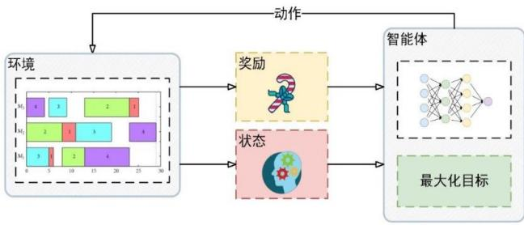
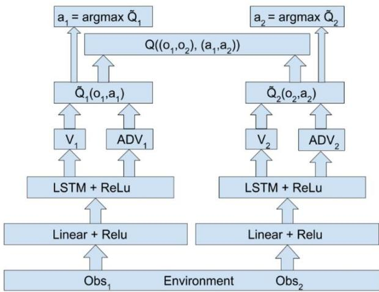
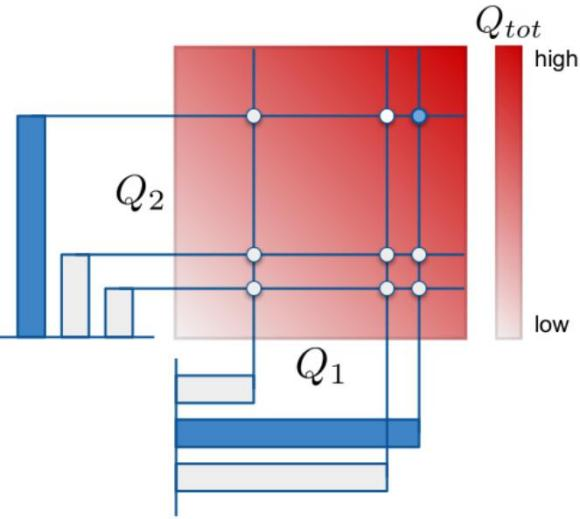

# 多智能体强化学习综述

23级计算机技术 夏乐 6720230789摘 要：强化学习是机器学习的一种方法，跨越了心理学、神经科学、计算机科学等多个学科，它的核心是智能体通过与环境不断交互来优化其策略，实现最大化长期奖励。强化学习自与深度学习结合以来，其取得了令人瞩目的成功。多智能体强化学习是强化学习的一个分支，它研究的是在包含多个相互作用的智能体的环境中，各个智能体优化自身策略以实现个体或团队的长期奖励最大化。在这样的设定中，智能体之间的关系大体可以分为竞争，合作、以及竞争-合作混合。显而易见的是，智能体数量由一变多，这更贴合现实环境，应用也更为广泛，但这却也要求智能体能够适应更为复杂多变的环境，训练难度大大增加。本文综述了多智能体强化学习的历史研究工作与最新发展动态，首先介绍了多智能体强化学习的基础理论以及经典算法或框架。随后,综合叙述了多智能体强化学习的最新进展，最后,对多智能体强化学习的前景和发展进行了总结与展望。目前多智能体强化学习在机器人控制、人机博弈、自动驾驶等领域取得了不错的进展,随着该项技术的不断发展，未来将被更广泛地应用于交通、金融、航天、军事等各个领域。

关键词：机器学习；深度学习；强化学习；多智能体强化学习；

中图分类号：(作者自行查找)DOI: (编辑给出)

文献标志码：A开放科学 (资源服务) 标识码 (OSID):

# A Survey of Multi-Agent Reinforcement Learning

Abstract：Reinforcement learning is a method of machine learning that spans multiple disciplines including psychology, neuroscience, and computer science. At its core, it involves agents continually interacting with their environment to optimize their policies, aiming to maximize long-term rewards. Since its combination with deep learning, reinforcement learning has achieved remarkable success. Multiagent reinforcement learning, a branch of reinforcement learning, studies how multiple interacting agents within an environment can optimize their policies to maximize individual or collective long-term rewards. In such settings, the relationships between agents can generally be categorized into competitive, cooperative, and a mix of both competitive and cooperative. It is clear that increasing the number of agents from one to many more closely resembles real-world environments, with broader applications. However, this also requires agents to adapt to more complex and dynamic settings, significantly increasing the training difficulty. This paper reviews the historical research and latest developments in multi-agent reinforcement learning, beginning with an introduction to the fundamental theories, classic algorithms and frameworks of multi-agent reinforcement learning. It then synthesizes the latest advances in the field, and finally, summarizes and forecasts the prospects and development of multi-agent reinforcement learning. To date, multi-agent reinforcement learning has made notable progress in fields such as robotics control, human-computer games, and autonomous driving. As the technology continues to evolve, it is expected to be more widely applied in various domains such as transportation, finance, aerospace, military, and beyond.

Key words：Machine Learning; Deep Learning; Reinforcement Learning; Multi-agent Reinforcement Learning

# 0 引 言

多智能体系统(Multi-agent System, MAS)是多个智能体组成的集合,其目标是将大而复杂的系统建设成小而彼此互相通信协调的易于管理的系统[1]。 自20 世纪70年代提出以来，多智能体系统已广泛应用于智能机器人、交通控制、分布式决策、商业管理、软件开发、虚拟现实等诸多领域。它已成为分析和模拟复杂系统的重要工具。多智能体系统源自分布式人工智能，旨在应对大规模、复杂的现实问题。在实际应用中，单一智能体的决策能力往往难以胜任，因此多智能体系统的出现填补了这一空白。使用一个中心化的智能体解决问题时,会遇到各种资源和条件的限制,导致单个智能体无法应对错综复杂的现实环境;而使用多个智能体相互协作可以解决很多复杂问题[2]。强化学习（Reinforcement Learning,RL）是一种机器学习方法，旨在通过与环境的交互来学习如何采取行动以最大化累积奖励。与监督学习不同，强化学习不依赖于预先标注的数据集，而是通过试错法和反馈信号来进行学习。强化学习的基本框架由智能体（Agent）、环境（Environment）、状态（State）、动作（Action）和奖励（Reward）组成。智能体在每个时间步从环境中观察到当前状态，根据策略（Policy）选择一个动作，并从环境中接收到相应的奖励和下一个状态，智能体的目标是找到一个策略，使得在长期内获得的累积奖励最大化。如图 1所示。

目前,结合多智能体系统和强化学习方法形 成 的 多 智 能 体 强 化 学 习 (Multi-Agent

Reinforcement Learning, MARL）正逐渐成为强化学习领域的研究热点之一,并在各个领域得到广泛应用[3,4]。在 20 世纪 90 年代，Littman[5] 提 出 了 基 于 马 尔 可 夫 决 策 过 程（Markov Decision Process, MDP）的框架，为解决众多强化学习问题提供了简单明确的数学基础。随后，许多研究者在此基础上展开了更深入的研究。近年来，随着深度学习的成功，人们开始将深度学习方法与传统强化学习算法相结合，形成了许多深度强化学习(DeepReinforcement Learning, DRL)算法，推动了单智能体强化学习领域的迅速发展。例如，DeepMind 公 司 开 发 的 围 棋 博 弈 系 统AlphaGo[6]在围棋领域击败了人类顶尖选手，取得了巨大成功，引起了社会各界的广泛关注。这一成就也激励了研究人员在多智能体强化学习领域投入更多精力。众多企业和高校，如 DeepMind、OpenAI 等，纷纷研发新的MARL 算法，并将其应用于实际生活中。目前，这些算法主要应用于机器人系统[7]、动态调度[8]、自动驾驶[9]以及互联网广告[10]等领域。

本文第2节简单介绍了多智能体强化学习的基础理论; 第3节结合深度强化学习的最新算法, 从不同角度对多智能体强化学习的最新研究进展进行了综述;第4节对多智能体强化学习在现实领域中的应用和前景进行了探讨;最后总结全文。

# 1 MARL 的基础理论

# 1.1 单智能体强化学习

根据反馈的不同，机器学习方法可以分为监督学习、非监督学习和强化学习。

强化学习的智能体通过不断与动态环境交互和尝试错误来进行学习。如图 1 所示，在每个过程中，智能体感知环境的完整状态并采取行动，然后使环境进入一个新的状态。随后，智能体会收到一个反馈，用于评估这次状态转移。这种反馈相比监督学习中的样本标记，信息量较少且具有延时性。这是因为在监督学习中，智能体总是被告知采取什么动作是正确的；同时，这种反馈的信息量又比没有标记的无监督学习要多，因为在无监督学习中，智能体需要自行发现正确的行动，并且得不到关于这次行动的任何明确反馈。单智能体强化学习的目标是通过与环境的持续交互学习最优策略，以最大化累积回报。在上图中，一个完整的强化学习任务包括几个重要组成部分：动作、状态、反馈和环境。强化学习的环境是马尔可夫过程，执行策略和价值函数是决策过程中重要的概念，最终强化学习的目标可以转化为解决最优贝尔曼方程。

  
图 1 强化学习基本框架

能体决策的建模框架。在 MDP 中，智能体与环境之间不断交互，根据状态、动作、奖励和状态转移概率来制定决策策略。MDP 的要素通常表示为<S, A, R, P>，其中 S 代表状态空间，A 代表动作空间，R 代表奖励函数，P 代表状态转移函数。MDP 中状态的转移关系由当前状态和采取的行动共同决定。MDP的求解目标是找到使预期收益最大化的策略。通常使用动作值函数 $Q ( s , a )$ 来形式化地表示预期收益。 $\mathsf { Q }$ 函数表示在某个状态下采取某个动作后，再根据策略 $\pi$ 继续执行一系列动作所获得的累积奖励的期望值。因此，$\mathsf { Q }$ 函数可以表示为 $Q _ { \pi } ( s , a )$ ，表示在状态 $_ S$ 下采取动作 $^ { a }$ 后按照策略 $\pi$ 继续执行所获得的累积奖励的期望值。通过优化 $\mathsf { Q }$ 函数，智能体可以找到最佳的决策策略，以最大化长期累积奖励。累计奖励的期望可以表示为：

$$
Q _ { \pi } ( s , a ) = E _ { \tau \sim \pi } [ R ( \tau ) | s , a ]
$$

在 MDP 中，智能体的目标是通过学习最优的策略来最大化长期奖励，从而在不确定性和随机性的环境中做出最佳决策。通过不断与环境交互和学习，智能体可以逐步优化其决策策略，以适应复杂的实际应用场景。

# 1.1.2 最优价值函数

MDP 下的基于策略 $\pi$ 的状态价值函数$v _ { \pi } ( s )$ 表示执行策略 $\pi$ 时个体在状态 $S$ 的价值大小,其数学表达式为:

# 1.1.1 马尔可夫决策过程

马 尔 可 夫 决 策 过 程 [11] （ MarkovDecision Process, MDP）是用于描述单智

$$
v _ { \pi } ( s ) = E _ { \pi } [ G _ { t } | s ]
$$

最优状态价值函数定义为：

$$
v ^ { * } = \operatorname* { m a x } v _ { \pi } ( s )
$$

MDP 下的行为价值函数被用于衡量在当前策略 $\pi$ 下对当前状态 $s$ 执行行为 $^ { a }$ 的最优价值。其数学表达式为式(1)。那么最优动作价值函数定义为：

$$
Q ^ { * } ( s , a ) = \operatorname* { m a x } Q _ { \pi } ( s , a )
$$

# 1.1.3 最优贝尔曼方程

将动作价值函数改写成贝尔曼方程形式如下所示：

$$
Q _ { \pi } ( s _ { t } , a _ { t } ) = R _ { t } + \gamma Q _ { \pi } ( s _ { t + 1 } , a _ { t + 1 } )
$$

其中, $\gamma$ 是折扣因子，表示未来奖励的重要程度。类似的，我们将式(5)最大化的到最优贝尔曼方程：

$$
Q ^ { * } ( s _ { t } , a _ { t } ) = R _ { t } + Q ^ { * } ( s _ { t + 1 } , a _ { t + 1 } )
$$

强化学习的问题最终可以转化为求解最优贝尔曼方程。由于这个方程是非线性的，因此需要通过一些方法来求解。这导致了两个重要的分类，所有强化学习问题的解决方法基本上可以归结为基于价值的和基于策略的方法。其中，基于价值函数的代表方法是 Q-learning[12]。

# 1.2 多智能体强化学习

多智能体系统源自分布式人工智能的领域，展现出了显著的自主性、分布性和协调性特点。这类系统不仅具备学习和推理的能力，还能自我组绑和适应复杂的环境。虽然智能体的概念最早在 20 世纪 40 年代被提出，但在 20 世纪 70 年代前，将多个智能体整合为一个统一系统的研究则相对较少。然而，进入 20 世纪 80 年代后期，随着博弈论概念的深入应用，分布式人工智能取得了突破性的进展，并逐步演化为今天我们所称的多智能体系统。这一转变标志着科学研究在理解和设计复杂交互网络方面的一个重大跃进。

随机博弈（Stochastic games, SG）是多智能体强化学习算法的基础求解模型，由MDP 衍 生 而 来 ， 由 元 组$( n , S , A _ { 1 } , A _ { 2 } , \dots , T , A _ { n } , r _ { 1 } , r _ { 2 } , \dots , r _ { n } , \gamma )$ 表示，其中 $\boldsymbol { \mathit { \Pi } } _ { \mathit { \Pi } }$ 为智能体的数量，S 是联合状态空间，$A _ { i }$ 表示地 $\ r _ { i }$ 个智能体的动作空间， $T$ 是联合状态转移函数， $r _ { i }$ 则表示第 $\ r _ { i }$ 个智能体的回报。在随机博弈中，智能体的下一状态的奖励和状态跟智能体的联合动作有关[13]。类似单智能体强化学习，在 MARL 中，每个智能体都与环境进行交互，通过环境中的奖励信息提升自身策略，但多智能体意味着环境的复制程度升高，从而为 MARL 环境下的智能体策略学习带来固有挑战。智能体数量增加带来的维度爆炸的问题，最终导致算法收敛困难、计算复杂[14]；多智能体中奖励机制设置复杂，往往存在着稀疏奖励的情况；学习到的模型泛化性较差，难以迁移到不同的场景中等[15]。 如经典算法多智能体深度确定性 策 略 [16](Multi-agent deepdeterministic policy gradient, MADDPG)在处理非平稳的环境中会很难收敛，同时MADDPG将其他智能体的信息作为输入状态，导致了算法无法应用于大规模多智能体场景 中 [17] 。 反 事 实 多 智 能 体 策 略 梯 度[18](Counterfactual multi-agent policygradients ,COMA)尝试通过联合训练智能体进行协同工作，但需要对每个智能体的策略空间进行显式建模，这在面对大规模智能体系统时可能会变得非常复杂[19]。

根据任务类型，多智能体强化学习可分为完全合作、完全竞争和混合型三种模式。在完全合作的随机博弈中，所有智能体共享相同的奖励函数，即 $| R _ { 1 } = R _ { 2 } = \cdots R _ { n } |$ ，因而他们的回报也是相同的，多智能体的共同目标是最大化整体回报。若 $\begin{array} { r } { \sum _ { i } ^ { n } R _ { i } = 0 } \end{array}$ ,那智能体之间的关系就是完全竞争。此外，更为复杂的既非完全竞争也非完全合作的策略，称之为混合策略。

在完全合作的随机博弈中，智能体可以共同努力以最大化回报。而在其他情况下，智能体的回报通常是多样且相互关联的，它们无法独立地实现最大化。因此，设计一个良好且通用的多智能体强化学习（MARL）目标是一大挑战。现有文献主要从两个方面对学习目标进行了阐述：稳定性和适应性。

稳定性涉及智能体学习动机的稳定性和策略的收敛性。适应性则确保智能体的表现不因其他智能体策略的变化而降低。策略最终收敛至均衡状态是稳定性的核心要求，常见的均衡状态是纳什均衡。适应性体现在理性或无悔的准则上：理性意味着在其他智能体策略稳定的情况下，智能体将收敛于最优策略；无悔则指智能体最终的策略产生的回报不会比任何其它策略的回报差。在明确了学习目标后，我们根据不同任务类型对经典的强化学习算法进行了分类和回顾。

# 1.2.1 完全合作的 MARL

在完全合作的 MARL 框架中,智能体有相同的奖励函数,与单智能体强化学习相同，智能体与环境交互并以环境中的奖励信息来 指 导 策 略 的 学 习，其 中独 立 Q 学 习[20](Independent Q-learning, IQL)是解决MARL 的一种分散式的多智能体经典算法，在 IQL 中，每个智能体将其他智能体视为环境的一部分，而不是直接与其他智能体进行交互，每个智能体都独立地学习自己的 $\mathsf { Q }$ 函数，用于估计其策略的价值。IQL 的优点在于简单性和工程实践中的可用性，但它无法保证收敛性，因为环境是非稳态的[21]。

然而，在决策过程中，各智能体并不是独立进行的，即便它们同时朝着一个共同的目标学习，因此考虑智能体之间的协作问题显得尤为重要。Team- $\cdot \mathsf { Q }$ 算法[22]通过假设最优的联合行动是唯一的方法来规避协作难题。与此同时，Distributed- $\cdot \mathsf { Q }$ 算法[23]在不预设协调一致性的前提下，以有限的计算资源解决协作任务，其计算复杂度与单智能体进行 $\mathsf { Q }$ 学习的复杂度类似。然而，这一算法仅适用于具有非负奖励函数的确定性问题。上述算法尽管具有应用价值，但存在一些局限性，主要是它们都依赖于对状态的精确测量，有些算法还需准确测量其他智能体的影响，并且这些算法还可能受到维度灾难的影响。

此外，部分研究聚焦于在团队中如何分配奖励，并对团队奖励进行分解。在多智能体强化学习（MARL）中，价值分解是一种技术，其目的是将多智能体系统的全局价值函数分解成多个较小、更易管理的部分。这些部分通常对应于每个智能体的个体贡献。价值分解的核心思想在于将全局价值函数（或动作-价值函数，即 $\mathsf { Q }$ 函数）拆解为若干个局部价值函数的总和或组合，这些局部价值函数与各单独智能体的策略和奖励直接相关。通过这种分解，每个智能体能够基于其局部奖励信息进行更有效的学习。值分解网络[21]（Value Decomposition Networks，VDN）是一种 MARL 框架，用于协调智能体之间的合作行为。VDN 的核心思想是将多智能体系统的整体价值函数（即群体的期望累积回报）分解为各个智能体价值函数的和。这种方法假定每个智能体对整体价值函数的贡献是可加的，从而简化了信用分配问题，即确定每个智能体在团队成功中所起的作用。VDN的基本假设是多智能体系统的联合 $\mathsf { Q }$ 值可以表示为各个智能体的 $\mathsf { Q }$ 值的和，可由下式表示。

$$
Q _ { t o t } \left( ( h ^ { 1 } , h ^ { 2 } , \dots , h ^ { d } ) , ( a ^ { 1 } , a ^ { 2 } , \dots a ^ { d } ) \right) \approx \sum _ { i = 1 } ^ { d } \tilde { Q } _ { i } \left( h ^ { i } , a ^ { i } \right)
$$

VDN 的结构如图 2 所示。

  
图 2 VDN 的基本结构

不久，一种新的值分解方法 $Q M I X ^ { [ 2 4 ] }$ 也被提出，???????? 对 ??????进行了扩展，克服了 ?????? 的一些局限性。特别是，它试图解决的问题是在多智能体系统中智能体相互作用的非线性分解。???????? 使用一个混合网络（mixing network）来表示全局的 $Q$ 值函数，该函数由每个智能体的单独 $Q$ 值函数以一种可训练的方式组合而成。QMIX 的见解是提取分散策略并不需要对 $Q _ { t o t }$ 进行完全因式分解。相反，只需确保对 $Q _ { t o t }$ 执行的全局 ???????????? 与对每个 $Q _ { a }$ 执行的一组单独 ???????????? 操作产生相同的结果。为此，只需对 $Q _ { t o t }$ 和每个 $Q _ { a }$ 之间进行单调性约束即可：

$$
\frac { \partial Q _ { t o t } } { \partial Q _ { a } } \geq 0 , \forall a .
$$

可以由图 3 直观显示。

  
图 3 QMI 的单调性约束

由于 VDN 和 QMIX 在因子分解中的结构约束（如可加性和单调性），它们只能处理一部分可因子化的多智能体强化学习（MARL）任务。 $\mathsf { Q T R A N } ^ { [ 2 5 ] }$ 是一种新的分解方法，它摆脱了上述结构约束，采用了一种新的方法，将原始的联合价值函数转化为一个易于实现的可因子化函数，同时保持相同的最优策略。QTRAN 通过提供比 VDN 或 QMIX 更通用的因子分解，确保能够涵盖比以前方法更广泛的 MARL 任务。

还有一个值得关注的方式是 Qatten，Qatten 引入的注意力机制[27](attention)来进行团队价值分解，具体是是使用多头注意力机制来近似全局的 Q 值，从而提供更精细的表示。它不引入其他假设限制，适用于复杂环境。

# 1.2.2 完全竞争的 MARL

在完全竞争的 MARL 的框架中，可认为是一个零和博弈(Zero-sum game)，即所有智能体的奖励相加等于 0(有正奖励与负奖励（惩罚）)。在这个领域，一些经典的算法主要基于传统的单智能体强化学习算法进行了适当的修改和拓展，以适应多智能体的动态和互动特性，比如 Minimax $\mathsf { Q } \mathrm { - } 1$ earning算法[28]，Minimax Q-learning 是在标准 $\mathrm { Q - }$ learning 算法的基础上，为零和博弈（一个智能体的收益与另一个智能体的损失成正比）设计的。它使用 minimax 原则来更新Q 值，旨在最小化在最坏情况下的最大可能损失。就目前的文献来看，对于完全竞争的MARL 的研究相对较少，为数不多的研究也仅仅是设定环境中只存在 2 个对抗智能体，研究人员更倾向于探讨合作、混合合作-竞争和协调性的多智能体问题，因为这些问题更加广泛且具有实际应用。

# 1.2.3 混合型 MARL

智能体之间既存在合作又存在竞争的情况。在这种环境中，智能体需要同时考虑与其他智能体合作以实现共同目标，以及与其他智能体竞争以获得更高的奖励。在这种模式下，智能体的奖励函数不受约束,最适合自私的智能体。博弈论中的均衡概念在混合随机博弈中得到了广泛应用，其中大量算法主要针对静态任务。单智能体算法如 Q 学习可被直接运用于混合型任务。在这种情形下，参数更新必须使用所有智能体的 $\mathsf { Q }$ 表，这意味着每个智能体需要复制其他智能体的 Q 表。因此，所有晁能体必须采用相同的算法，并能够访问所有动作和奖励的信息。尽管采用这些假设，当不同智能体得出的策略不一致时，仍然可能出现均衡选择的问题。一种常用的方法是 Nash $\mathsf { Q }$ -learning[29],此外还有相关平 衡 $\mathsf { Q }$ 学 习 [30] $\left( \mathrm { C E ^ { - } Q } \right)$ 或不对称 $\mathsf { Q }$ 学 习[31](Asymmetric $\mathsf { Q }$ -learning),它们可以分别通过使用相关或 Stackelberg(前导-跟随)平衡来解决均衡问题.对于不对称 $\mathsf { Q }$ 学习,跟随者不需要对领导者的 Q表进行建模,但是领导者必须知道追随者如何选择其行动。然而,传统的 MARL 算法多适用于小规模的问题,很少有算法能应用于信息不完整或不确定的环境.提高 MARL 对实际问题的适应性是一个必不可少的研究步骤[32]。

# 2 MARL 的研究进展

经典的 MARL 算法主要针对较简单的应用场景设计，如静态游戏或小型网格环境。然而，在更具挑战性的实际场景中，智能体通常面对广泛而复杂，甚至是连续的状态和动作空间。传统MARL 算法在处理这样的不完整和不确定环境时显得力不从心。此外，处理不完整信息的能力和算法的可扩展性，历来都是单智能体强化学习中的难题。幸运的是，随着深度学习技术的飞速发展，单智能体强化学习中诸如可扩展性等问题已经得到了有效的缓解。利用深度学习的进步，研究人员已经在多智能体系统的算法中取得了重要进展。他们不仅提升了算法处理复杂环境的能力，还在智能体意图推断、奖励机制设计和环境建模等多方面进行了创新和改进。这些进步为多智能体系统的研究和应用打开了新的可能性，使得这些系统更加强大和适用于现实世界的复杂问题。

# 2.1 深度强化学习

深度强化学习是一种将深度学习和强化学习结合的技术，用以解决复杂决策问题。在这种方法中，深度神经网络被用来处理高维的感测输入，学习表示复杂环境中的状态或处理状态到动作的映射。通过交互式地探索环境并从中获得奖励或惩罚，智能体可以自我学习以优化其行为策略，最大化长期的累积奖励。深度强化学习的核心优势在于其能够自动发现输入数据的有用特征并有效地处理之前无法处理的大规模和高复杂度问题，例如玩视频游戏、自动驾驶汽车等。这使得深度强化学习在众多领域中都显示了巨大的潜力和应用前景。

# 2.1.1 深度 Q 网络

深度 $\mathsf { Q }$ 网络[33]（Deep $\mathsf { Q }$ -Network，DQN）是一种结合了经典的 $\mathsf { Q }$ 学习算法和深度神经网络的强化学习技术，由 Mnih 等提出。在 $\mathsf { Q }$ 学习中，算法通过维护一个 $\mathsf { Q }$ 表来学习在给定状态下采取不同行动的预期收益。然而，在面临大规模状态空间时，Q 表的方法变得难以实施。DQN解决这一问题的方法是使用深度神经网络来逼近 Q 值函数，从而使网络可以从历史经验中学习并预测每个动作的潜在价值。这样，DQN可以有效地处理高维状态空间，并能进行端到端的学习，其输入直接是原始的观测数据，输出则是每个可能动作的 $\mathsf { Q }$ 值。DQN 的引入标志着深度学习在强化学习领域的重大突破，极大地推动了复杂决策问题解决方案的发展。除了利用卷积神经网络逼近行为值函数，Mnih还提出其他两项关键技术：1) 用经验重放技术打破了样本间的关联性,将采集到的样本先放入样本池,然后从池中随机选出一个样本用于网络训练;2)设置了目标网络来单独处理时间差分算法中的 TD偏差,使训练的稳定性和收敛性得到极大的提高。

近年来，围绕 DQN 的研究不断深入，众多学者提出了多种创新的改进方案以增强其性能。例如，Hasselt 等人[34]提出的双 DQN（Double Deep $\mathsf { Q }$ -Network， DDQN）算法有效地解决了值估计过度乐观的问题，通过引入两个网络来分离评估与选择过程，从而确保估计更加稳健。Schaul[35]等人则采取了经验优先回放技术，通过给予具有较高优先级的经验较多的学习机会，以加速学习过程中重要信息的提取。此外，Osband[36]、Munos[37]以及 Francois-Lavet[38]等研究者也分别从不同的视角对DQN进行了进一步的优化和改进。这些研究不仅拓展了 DQN 的应用范围，也极大地提升了算法在实际应用中的效率和可靠性。

# 2.1.2 演员-评论家算法

演员-评论家（Actor-Critic, AC）算法是一种强化学习方法，它结合了值函数方法和策略梯度方法的优点，以较好地平衡学习的效率和稳定性。最早,Witten 于 1977年提出了类似 AC 算法的方法;然后,Barto,Sutton和 Anderson 等人于 1983 年引入了 AC 架构.但是,AC 算法的研究难度和一些历史偶然因素使得之后学术界开始将研究重点转向基于价值的方法。之后的一段时间里,基于价值的方法和基于策略的方法都有了蓬勃的发展.AC 算法结合了两者的发展红利,在理论和实践方面再次有了长足的发展.这种算法包括两个主要部分：演员（Actor）和评论家（Critic）。

演员（Actor）:演员的角色是基于当前策略选择行动。这部分的网络接收环境状态作为输入，并输出一个行动或行动分布。演员的目标是通过学习策略提升获得的收益，通常是利用策略梯度方法来实现的。这意味着演员的训练旨在调整策略参数以最大化长期回报。

评论家（Critic）:评论家评估当前政策采取行动后获得的收益情况，通常通过学习状态值函数（如状态行为值函数 V(s)或Q(s,a)）来进行。评论家的输出用来评估演员的行为表现，提供一个关于当前策略好坏的反馈信号（TD 误差或价值函数的梯度信息），这有助于指导演员进行更合理的决策。演员和评论家通过相互合作，不断调整和改进策略和价值函数，以达到更优的学习效果。具体实施时，演员依据评论家给出的反馈进行策略更新，而评论家则根据演员的表现更新价值估计。这种结构使得演员-评论家算法能够有效地在连绠动作空间和复杂环境中进行学习，相比单纯采用价值基础或策略基础的方法，演员-评论家算法通常具有更好的稳定性和收敛速度。

# 2.1.3 深度确定性策略梯度

DQN 是一种依赖于价值函数的方法，它在处理具有较大连续动作空间的情境时遇到挑战，因为它不能直接输出连续状态下的动作值。为了克服这一限制，Lillicrap 等人[39]在2015 年提出了深度确定性策略梯度（DDPG）方法。DDPG 是建立在演员-评论家（AC）算法基础之上的，它整合了确定性策略梯度算法，并通过一个网络来逼近策略函数，从而能够直接产生动作，适应连续动作输出和更广阔的动作空间。

除此之外，AC 框架还催生了许多变体算法，例如异步优势演员-评论家（A3C）算法[40]和分布式近似策略优化（DPPO）算法。A3C算法由Mnih 等人在 2016 年提出，该算法在 DQN 的基础上进行了创新，为了打破训练样本间的相关性，它采用了经验重放技术，即将训练样本存储起来，并在每次训练时随机抽取一个小批量（minibatch）进行学习。与此同时，A3C 利用多线程并行采集数据，每个线程都以一个独立的智能体在独立的环境中探索；此外，每个智能体可以并行地采用不同的探索策略进行数据采样。这种方法使得每个线程产生的样本在本质上是无关的，并且采样速度得到了显著提升。

# 2.2 MARL 算法进展

# 2.2.1 MARL 主流算法

受到强化学习与深度学习技术结合的启发，研究人员已将深度 Q 网络（DQN）和深度确定性策略梯度（DPG）等先进技术应用于多智能体强化学习领域。近期，绝大多数的研究工作都集中在这一领域，探索如何通过这些技术提高多智能体系统的性能和效率。在将DQN技术扩展到多智能体强化学习（MARL）中，遇到的主要挑战之一是传统的经验重放机制可能不再适用，尤其是在不了解其他智能体状态的情况下，因为在情景的设定下，每个智能体将其余智能体当成环境的一部分，但其他智能体的策略会不断变化，导致环境不稳定，就意味着环境不可重现，所有经验也就没有用。Foerster 等[41]研究者针对这一问题提出了两种改进方法，以增强多智能体系统使用经验重放技术时的稳定性和兼容性。一种方法是采用带有重要性抽样的多智能体变量，自然地减弱过时数据的影响，并将重放数据视为环境外数据处理[42]。由于较旧的数据往往具有较低的重要性，这种策略有助于避免因固定重放经验而产生的混淆。另一种方法是允许每个智能体通过观察其他智能体的决策来推测其行为，这种策略使得算法能够适用于更广泛的深度网络环境。这些改进是在传统多智能体算法，如 IQL，的基础上进行的，显著提升了算法的实用性和效果。但基于 IQL 的 MARL 算法在实践过程中会出现“lazy agent”和“spurious reward”现象，“lazy agent”发生在当部分智能体习得好的策略时，其他智能体不被鼓励去学习，因为它们的探索很可能会导致团队奖励变差。“spurious reward” 是当某智能体做出一个好的动作，但由于队友的原因，得到了一个较低的团队奖励，从而影响该智能体的策略学习。

还有一些关于 DQN 的多智能体应用的其他工作。Tuyls[43]等人在他们的研究中引入了LDQN 算法，该算法将容忍策略融入到深度 $\mathsf { Q }$ 网络中，通过采用宽容的处理方式来更新消极策略，显著提高了算法的收敛性和稳定性。另一方面，Zheng[44]等人提出了一种新颖的多智能体深度强化学习框架，名为加权双深度 Q网络（WDDQN）。WDDQN 通过结合深度神经网络和加权双估计器的策略，不仅有效地减少了估计偏差，而且还能够适应多种深度强化学习场景。经验证明，WDDQN 在随机合作环境中的表现和收敛速度均超过了现有的深度强化学习（如双 DQN）和多智能体强化学习（如宽松 Q 学习）算法[45]。

近期，一些学者开始探索将基于 AC 框架的算法应用于多智能体强化学习。OpenAI 提出 的 多 智 能 体 深 度 确 定 性 策 略 梯 度[16]（MADDPG）算法，是在深度确定性策略梯度（DDPG）基础上的一种扩展。在 MADDPG 中，每个智能体都拥有一个独立的演员，根据自身观察的状态输出动作，并仅利用自己生成的数据进行训练。与此同时，每个智能体也有一个对应的评论家，但不同于 DDPG，这里的评论家会接收所有智能体的信息，实现一种中心化的数据处理方式。这种算法有效地解决了在多智能体环境下 DQN 中经验重放的局限性和 DPG 方差过大的问题。多智能体强化学习中融合基于 AC框架的算法，展现了其作为未来研究方向的重要性和潜力。

# 2.2.2 奖励函数设置

在多智能体系统（MAS）中设计有效的奖励机制要比单智能体系统中的设计复杂得多。在多智能体强化学习（MARL）中，目前所应用的奖励信号存在一些显著问题。例如，全局奖励信号将相同的奖励分配给所有智能体，而忽略了它们各自的贡献，这可能导致某些智能体采取“懒惰”行为，依赖于其他智能体的努力。另一方面，本地奖励信号仅根据单个智能体的行为提供反馈，可能会激励智能体采取自私行为，而不是促成合作。为了解决这一难题，研究人员已经设计了各种混合奖励信号[46-47]了全局和本地奖励的优点，鼓励智能体学习更加有效的合作策略。实验结果显示，这种混合信号的方法能显著提高整体性能。在混合奖励信号之外，Omidshafiei 等人[48]的研究揭示了在智能体之间增加通信机制可以显著提升团队的整体表现。他们在 MARL中首次引入了教学机制，这是一个革命性的步骤。他们的主要贡献在于将元学习（meta-learning）的概念引入到合作型多智能体强化学习中，将智能体的学习进度和经验作为奖励反馈机制的一部分。这种方法不仅促进了智能体间的有效沟通，而且还允许智能体从彼此的学习进度中获取奖励，从而加速学习过程并稳定收敛性能。这种创新的奖励设计为多智能体系统的协作与学习提供了新的视角，并有望在复杂环境中推动智能体群体的协同进化。

# 3 MARL 前景展望

近年来,MARL 在许多领域都得到了实际应用,尤其在机器人系统、人机博弈和自动驾驶等领域开展的研究较多。Foerster 等人[49]在将多智能体强化学习应用于机器人通信领域方面取得了开创性的进展。他们采用了一种集中式学习与分散式执行的策略，这是首次实现了机器人之间的深层交流。此外，Duan等人[50]在机器人控制实践中的工作，为多智能体强化学习的实际应用提供了重要的启示。在人工智能领域，人机博弈一直是最具挑战性和令人激动的研究领域之一。2018 年，OpenAI 和 DeepMind 分别取得了显著成就。OpenAI 的算法在实时 5v5 策略游戏 Dota 2中战胜了人类顶尖玩家，而 DeepMind的算法在复杂的第一人称射击游戏 Quake IIIArena 中达到了与人类相当的水平，并能够与人类玩家进行协作[51]。在自动驾驶技术领域，Shalev-Shwartz 等人[9]对自动驾驶车辆的安全性和应对环境不确定性的能力进行了重要的改进和优化。他们展示了如何在没有马尔可夫决策过程（MDP）假设的情况下，使用策略梯度方法进行迭代，并利用随机梯度上升来最小化梯度估计的方差。这些研究不仅推动了自动驾驶技术的发展，也为多智能体系统在实际复杂环境中的应用提供了新的思路和解决方案。

多智能体强化学习（MARL）展望着在众多领域实现革命性的改变，特别是那些需要协调多个自治实体以达成共同目标的场景。例如，在智能交通系统中，MARL 可以优化交通信号和车辆的动态调度，减少拥堵和提高安全性。在无人机群协作领域，通过 MARL，无人机能够进行高效的空中协同，执行复杂的任务如搜索与救援或环境监测。此外，MARL 在分布式能源管理系统中也显示出巨大潜力，能够优化多个能源单元的输出，以应对需求波动并提升系统的能效。在工业自动化和智能制造领域，MARL 能帮助机器人理解和预测其他机器人的行为，并协同工作以提高生产效率和降低成本。网络安全是另一个有前途的应用领域，其中多智能体系统能够协同工作以实时防御多种网络攻击。正是这些具体应用的广泛需求，驱动了对 MARL 技术的深入研究和快速发展。随着技术的成熟和对策略协同及通讯机制的进一步优化，预计 MARL 将在未来的智能系统中发挥更加关键的作用，实现更广范围的社会和经济效益。

结语 本文综述了多智能体强化学习（MARL），涉及其理论、算法与应用，并突出了该领域的研究热度与算法创新。我们从 MARL 的基础理论出发，探讨了算法的可扩展性和优化，最后讨论了其在实际中的应用和前景。MARL 作为一个迅速进化的领域，其解决复杂问题的潜力预示着智能系统将不断进步，朝着全面智能化的目标迈进。

# 4 参考文献

[1] 杜威, 丁世飞. 多智能体强化学习综述[J]. 计算机科学, 2019, $4 6 \left( 8 \right) : ~ 1 - 8 .$ .  
[2] 赵志宏, 高阳, 骆斌, 等. 多 Agent系统中强化学习的研究现状和发展趋势[J]. 计算机科学, 2004, 31(3): 23-27.  
[3] 杨文臣, 张轮. 多智能体强化学习在城市交通网络信号 控制方法中的应用综述 [J]. Application Research ofComputers/Jisuanji Yingyong Yanjiu,

2018, 35(6).

[4] Gergely M I. Multi-Agent Deep Reinforcement Learning for Collaborative Task Scheduling[C]//ICAART (3). 2024: 1076-1083.

[5] Littman M L. Markov games as a framework for multi-agent reinforcement learning[M]//Machine learning proceedings 1994. Morgan Kaufmann, 1994: 157-163.

[6] Granter S R, Beck A H, Papke Jr D J. AlphaGo, deep learning, and the future of the human microscopist[J]. Archives of pathology & laboratory medicine, 2017, 141(5): 619-621.

[7] Gu S, Holly E, Lillicrap T, et al. Deep reinforcement learning for robotic manipulation with asynchronous off-policy updates[C]//2017 IEEE international conference on robotics and automation (ICRA). IEEE, 2017: 3389-3396.

[8] Gu W, Liu S, Guo Z, et al. Dynamic scheduling mechanism for intelligent workshop with deep reinforcement learning method based on multi-agent system architecture[J]. Computers & Industrial Engineering, 2024, 191:

110155.

[9] Shalev-Shwartz S, Shammah S, Shashua A. Safe, multi-agent, reinforcement learning for autonomous driving[J]. arXiv preprint arXiv:1610.03295, 2016.

[10] Jin J, Song C, Li H, et al. Realtime bidding with multi-agent reinforcement learning in display advertising[C]//Proceedings of the 27th ACM international conference on information and knowledge management. 2018: 2193-2201.

[11] Bellman R. Dynamic programming[J]. science, 1966, 153(3731): 34-37.

[12] Watkins C J C H, Dayan P. $\mathrm { Q - }$ learning[J]. Machine learning, 1992, 8: 279-292.

[13] Hessel M, Modayil J, Van Hasselt H, et al. Rainbow: Combining improvements in deep reinforcement learning[C]//Proceedings of the AAAI conference on artificial intelligence. 2018, 32(1).

[14] Lin X, Tang Y, Lei X, et al. MARL-based distributed cache placement for wireless networks[J]. IEEE Access, 2019, 7: 62606-62615.   
[15] Hu J, Wellman M P. Multiagent reinforcement learning: theoretical framework and an algorithm[C]//ICML.   
1998, 98: 242-250.

[16] Lowe R, Wu Y I, Tamar A, et al. Multi-agent actor-critic for mixed cooperative-competitive environments[J]. Advances in neural information processing systems, 2017, 30.

[17] Wang R E, Everett M, How J P. RMADDPG for partially observable environments and limited communication[J]. arXiv preprint arXiv:2002.06684, 2020.

[18] Foerster J, Farquhar G, Afouras T, et al. Counterfactual multiagent policy gradients[C]//Proceedings of the AAAI conference on artificial intelligence. 2018, 32(1).

[19] Su J, Adams S, Beling P A. Counterfactual multi-agent reinforcement learning with graph convolution communication[J]. arXiv preprint arXiv:2004.00470, 2020.

[20] Kostrikov I, Nair A, Levine S. Offline reinforcement learning with implicit q-learning[J]. arXiv preprint arXiv:2110.06169, 2021.

[21] Sunehag P, Lever G, Gruslys A, et al. Value-decomposition networks for cooperative multi-agent learning[J]. arXiv preprint arXiv:1706.05296, 2017.

[22] Littman M L. Value-function reinforcement learning in Markov games[J]. Cognitive systems research, 2001, 2(1): 55-66.

[23] Lauer M, Riedmiller M A. An algorithm for distributed reinforcement learning in cooperative multi-agent systems[C]//Proceedings of the seventeenth international conference on machine learning. 2000: 535-542.

[24] Rashid T, Samvelyan M, De Witt C S, et al. Monotonic value function factorisation for deep multi-agent reinforcement learning[J]. Journal of Machine Learning Research, 2020, 21(178): 1-51.

[25] Son K, Kim D, Kang W J, et al. Qtran: Learning to factorize with transformation for cooperative multi-agent reinforcement learning[C]//International conference on machine learning. PMLR, 2019: 5887-5896.

[26] Yang Y, Hao J, Liao B, et al. Qatten: A general framework for cooperative multiagent reinforcement learning[J]. arXiv

preprint arXiv:2002.03939, 2020. [27] Vaswani A, Shazeer N, Parmar N, et al. Attention is all you need[J]. Advances in neural information processing systems, 2017, 30.

[28] Diddigi R B, Kamanchi C, Bhatnagar S. A generalized minimax $\mathsf { Q }$ -learning algorithm for two-player zero-sum stochastic games[J]. IEEE Transactions on Automatic Control, 2022, 67(9): 4816-4823.

[29] Hu J, Wellman M P. Nash $\mathrm { Q - }$ learning for general-sum stochastic games[J]. Journal of machine learning research, 2003, 4(Nov): 1039-1069.

[30] Greenwald A, Hall K, Serrano R. Correlated $\mathsf { Q }$ -learning[C]//ICML. 2003, 3: 242-249.

[31] Könönen V. Asymmetric multiagent reinforcement learning[J]. Web Intelligence and Agent Systems: An international journal, 2004, 2(2): 105-121.

[32] Hu J, Wellman M P. Multiagent reinforcement learning: theoretical framework and an algorithm[C]//ICML. 1998, 98: 242-250.

[33] Mnih V, Kavukcuoglu K, Silver D, et al. Playing atari with deep reinforcement learning[J]. arXiv preprint arXiv:1312.5602, 2013.

[34] Van Hasselt H, Guez A, Silver D. Deep reinforcement learning with double q-learning[C]//Proceedings of the AAAI conference on artificial intelligence. 2016, 30(1).

[35] Schaul T, Quan J, Antonoglou I, et al. Prioritized experience replay[J]. arXiv preprint arXiv:1511.05952, 2015.

[36] Osband I, Van Roy B, Wen Z. Generalization and exploration via randomized value functions[C]//International Conference on Machine Learning. PMLR, 2016: 2377-2386.

[37] Munos R, Stepleton T, Harutyunyan A, et al. Safe and efficient off-policy reinforcement learning[J]. Advances in neural information processing systems, 2016, 29.

[38] François-Lavet V, Fonteneau R, Ernst D. How to discount deep reinforcement learning: Towards new dynamic strategies[J]. arXiv preprint arXiv:1512.02011, 2015.

[39] Lillicrap T P, Hunt J J, Pritzel A, et al. Continuous control with deep reinforcement learning[J]. arXiv preprint arXiv:1509.02971,

2015. [40] Mnih V, Badia A P, Mirza M, et al. Asynchronous methods for deep reinforcement learning[C]//International conference on machine learning. PMLR, 2016: 1928-1937.

[41] Foerster J, Nardelli N, Farquhar G, et al. Stabilising experience replay for deep multi-agent reinforcement learning[C]//International conference on machine learning. PMLR, 2017: 1146-1155.

[42] Ciosek K, Whiteson S. Offer: Off-environment reinforcement learning[C]//Proceedings of the aaai conference on artificial intelligence. 2017, 31(1).

[43] Palmer G, Tuyls K, Bloembergen D, et al. Lenient multi-agent deep reinforcement learning[J]. arXiv preprint arXiv:1707.04402, 2017.

[44] Zheng Y, Meng Z, Hao J, et al. Weighted double deep multiagent reinforcement learning in stochastic cooperative environments[C]//PRICAI 2018: Trends in Artificial Intelligence: 15th Pacific Rim International Conference on Artificial

Intelligence, Nanjing, China, August 28–31, 2018, Proceedings, Part II 15. Springer International Publishing, 2018: 421-429.

[45] Tampuu A, Matiisen T, Kodelja D, et al. Multiagent cooperation and competition with deep reinforcement learning[J]. PloS one, 2017, 12(4): e0172395.

[46] Li P, Hao J, Tang H, et al. Race: improve multi-agent reinforcement learning with representation asymmetry and collaborative evolution[C]//International Conference on Machine Learning. PMLR, 2023: 19490-19503.

[47] Wang L, Zhang Y, Hu Y, et al. Individual reward assisted multiagent reinforcement learning[C]//International Conference on Machine Learning. PMLR, 2022: 23417-23432.

[48] Omidshafiei S, Kim D K, Liu M, et al. Learning to teach in cooperative multiagent reinforcement learning[C]//Proceedings of the AAAI conference on artificial intelligence. 2019, 33(01): 6128- 6136.   
[49] Foerster J, Assael I A, De

Freitas N, et al. Learning to communicate with deep multi-agent reinforcement learning[J]. Advances in neural information processing systems, 2016, 29.

[50] Duan Y, Chen X, Houthooft R, et al. Benchmarking deep reinforcement learning for continuous control[C]//International conference on machine learning.

PMLR, 2016: 1329-1338.

[51] Lanctot M, Zambaldi V, Gruslys A, et al. A unified game-theoretic approach to multiagent reinforcement learning[J]. Advances in neural information processing systems, 2017, 30.