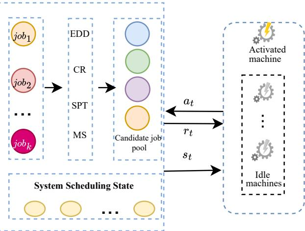

# Curiosity-Driven Reinforcement Learning for Dynamic Flexible Job Shop Scheduling

$1 ^ { \mathrm { s t } }$ Le Xia∗, $2 ^ { \mathrm { n d } }$ Tao $\mathrm { { X u ^ { * } } }$ , $3 ^ { \mathrm { r d } }$ Zhiwei Liu∗, and $4 ^ { \mathrm { t h } }$ Bi Wang∗† ∗School of Information Engineering, Jiangxi University of Science and Technology, Ganzhou 341000, China †Jiangxi Provincial Key Laboratory of Multidimensional Intelligent Perception and Control, Ganzhou 341000, China Emails: {6720230789, 6720230825, 6720230855} $@$ mail.jxust.edu.cn, wangbi@jxust.edu.cn

Abstract—The dynamic flexible job shop scheduling (DFJSP) problem involves assigning appropriate jobs to available machines in real time under uncertain conditions. Reinforcement learning (RL) approaches hold promise for adaptive scheduling but often suffers from sample inefficiency due to sparse and delayed rewards. This paper proposes a curiosity-driven RL framework for the DFJSP with stochastic job arrivals. A centralized policy sequentially activates machines to select jobs with the objective of minimizing total tardiness. The curiositybased intrinsic reward is incorporated to alleviate the exploration deficiency by encouraging the agent to explore novel and informative states. This intrinsic motivation improves sample efficiency in dynamic and sparse-rewards environments. The performance gain depends on scenario characteristics: it is particularly pronounced in high-load, dynamic environments, while in low-load, more predictable settings, improvements are moderate. These findings highlight the framework’s potential for adaptive, data-efficient scheduling under uncertainty.

Index Terms—Dynamic Flexible Job Shop Scheduling, Reinforcement Learning, Intrinsic Motivation, Curiosity-Driven Learning, Stochastic Job Arrivals

# I. INTRODUCTION

The Dynamic Flexible Job Shop Scheduling Problem (DFJSP) is a challenging combinatorial optimization problem in modern manufacturing systems [1]. Extending the classical Job Shop Scheduling Problem (JSSP), DFJSP adds flexibility—allowing each operation to be processed on multiple alternative machines—and dynamism—capturing stochastic factors such as random job arrivals and environmental uncertainties [2], [3]. These features make DFJSP NP-hard and timedependent, rendering traditional heuristics and mathematical optimization methods computationally intractable [4].

In recent years, Reinforcement Learning (RL), particularly Deep Reinforcement Learning (DRL), has emerged as a promising paradigm for adaptive and data-driven scheduling [5]. By formulating the scheduling process as a Markov Decision Process (MDP), an RL agent can learn a mapping from system states (e.g., machine conditions, job queues) to actions (e.g., selecting which job to process) through interaction with the environment. This framework enables the discovery of effective scheduling policies that adapt to dynamic and stochastic conditions without relying on handcrafted rules or explicit system modeling [6]. However, applying RL to DFJSP remains sample-inefficient exploration due to the sparse and delayed reward problem inherent in scheduling tasks [7].

In most DFJSP settings, the primary objective—such as minimizing total tardiness or makespan—can only be measured after all jobs have been completed. Consequently, the agent receives a single terminal reward after a long sequence of scheduling decisions [8]. This results in sparse and delayed feedback, making it difficult to assign credit to individual actions that contributed to the final performance [9]. The weak and noisy learning signal reduces sample efficiency, slows convergence, and often leads to unstable or suboptimal policies [10]. In effect, the agent must navigate a vast decision space with little intermediate guidance.

To alleviate this challenge, various techniques have been proposed. Reward shaping [11] is one of the most common strategies, in which domain-specific dense rewards are manually designed to provide more frequent feedback. For instance, intermediate rewards may be based on reductions in idle time or operation delay to encourage efficient resource utilization [12]. Although such approaches can accelerate learning, they heavily rely on expert knowledge, and a poorly designed reward function can bias the learning process toward locally optimal but globally suboptimal solutions [7].

This paper proposes a curiosity-driven reinforcement learning framework for DFJSP with stochastic job arrivals. The agent operates from a machine-centric perspective, sequentially selecting which job each available machine should process next, and leverages a curiosity-based intrinsic reward to encourage exploration toward novel and informative scheduling states.

Comprehensive experiments on six DFJSP scenarios show that incorporating intrinsic motivation consistently improves total tardiness and accelerates convergence compared to a baseline agent. The benefits are especially pronounced under highly dynamic conditions with larger job counts or higher arrival rates. These observations highlight the effectiveness of curiosity-driven exploration in overcoming sparse reward challenges and suggest a promising direction for developing more autonomous and adaptable intelligent scheduling systems

# II. METHODOLOGY

# A. Problem Formulation

The DFJSP with stochastic job arrivals is defined as follows. A set of jobs $J = \{ J _ { 1 } , J _ { 2 } , \dots , J _ { n } \}$ arrives over time and must be processed on a set of machines $M = \left\{ M _ { 1 } , M _ { 2 } , \dots , M _ { m } \right\}$ . Each job $J _ { i }$ consists of $N _ { i }$ operations $O _ { i , j }$ , each executable on one of several alternative machines $M _ { i , j } \subseteq M$ with processing time $t _ { i , j , k }$ on machine $M _ { k }$ . Each job has an arrival time $a _ { i }$ , due date $d _ { i }$ , and completion time $C _ { i }$ . The objective is to minimize total tardiness:

$$
\operatorname { M i n i m i z e } \sum _ { i = 1 } ^ { n } \operatorname* { m a x } \{ C _ { i } - d _ { i } , 0 \}
$$

To ensure feasibility, the following constraints must be satisfied: 1)Each machine processes at most one operation at any time; 2)Operations of each job follow a fixed order; 3)Once started, an operation runs to completion; 4)Setup, transfer, and decision delays are ignored;

# B. Reinforcement Learning Formulation

The DFJSP is formulated as an MDP $( S , A , P , r , \gamma )$ . At each decision step $t$ , a centralized agent selects a job for an active machine. If multiple machines become idle simultaneously, one is randomly chosen to make a decision, ensuring a sequential and conflict-free scheduling process.

The state $s _ { t } \in S$ comprises local features, which describe the immediate decision context, and global features, which capture the overall system status. A detailed breakdown of the features constituting the state vector is presented in Table I. The action $a _ { t } \in A$ corresponds to selecting one job from a dynamically constructed candidate set, described in Subsection II-C. After execution, the agent receives a reward, described in Subsection II-D. An overview is shown in Fig .1.

TABLE I: State features for the scheduling agent.   

<table><tr><td>Category</td><td>Feature</td><td>Description</td></tr><tr><td rowspan="2">Local</td><td>Orem Trem</td><td>Remaining operations for each candidate job Remaining processing time for each candidate</td></tr><tr><td>Tslack</td><td>job Slack time: due date minus remaining processing time</td></tr><tr><td rowspan="2">Global</td><td>Um μTrem</td><td>Current machine utilization Mean remaining processing time of all unfin- ished jobs</td></tr><tr><td>OTrem μUM</td><td>Std. deviation of remaining processing time Mean machine utilization</td></tr></table>

# C. Action Masking and Candidate Generation

At each decision step, the active machine $m$ determines the set of jobs that are eligible for its next processing operation. To structure the action space, four classical priority dispatching rules (PDRs)–Earliest Due Date (EDD), Critical Ratio (CR), Shortest Processing Time (SPT), and Minimum Slack (MS)– are used to rank the available jobs. Each rule contributes its highest-ranked job that is not already included in the candidate pool $\mathcal { C }$ , proceeding down the ranking if necessary to avoid duplicates. This process yields at most four distinct candidate actions. If fewer than four candidates are obtained, dummy masked actions are added to ensure a fixed action dimension.

  
Fig. 1: Four dispatching rules (EDD, CR, SPT, MS) each recommend one candidate job. If fewer than four feasible jobs exist, masked dummy actions maintain a fixed action space. The state vector is constructed from features of these candidates and global system attributes.

# D. Extrinsic and Intrinsic Reward

The proposed framework combines extrinsic rewards for scheduling objectives with intrinsic rewards to enhance learning under sparse feedback.

a) Extrinsic Reward: The primary objective of the scheduling task is to minimize the total tardiness of all jobs. At the end of each episode, the total tardiness is computed as

$$
T _ { \mathrm { t o t a l } } = \sum _ { i = 1 } ^ { n } \operatorname* { m a x } ( 0 , C _ { i } - d _ { i } ) ,
$$

where $C _ { i }$ and $d _ { i }$ denote the completion time and due date of job $i$ , respectively. A negative terminal reward is then assigned to stabilize training:

$$
r _ { T } ^ { \mathrm { e x t } } = - \log ( 1 + T _ { \mathrm { t o t a l } } ) .
$$

The logarithmic transformation stabilizes training by smoothing large tardiness values and reducing gradient variance. No external reward is given at intermediate steps, i.e., $r _ { t } ^ { \mathrm { e x t } } = 0$ for $t < T$ .

$b$ ) Intrinsic Reward: ICM: To encourage exploration under sparse extrinsic feedback, we employ the Intrinsic Curiosity Module (ICM) [13]. ICM consists of a forward model predicting the next-state representation $\hat { \phi } ( s _ { t + 1 } )$ given $( s _ { t } , a _ { t } )$ , and an inverse model reconstructing the action from $\left( { { s _ { t } } , { s _ { t + 1 } } } \right)$ . The intrinsic reward is defined as the forward model’s prediction error:

$$
r _ { t } ^ { \mathrm { I C M } } = \lVert \hat { \phi } ( s _ { t + 1 } ) - \phi ( s _ { t + 1 } ) \rVert _ { 2 } ^ { 2 } ,
$$

where $\phi ( \cdot )$ denotes a shared feature encoder. This reward motivates the agent to visit transitions that are difficult to predict. The forward model error can be decomposed into epistemic (reducible) and aleatoric (irreducible) components:

$$
\begin{array} { r }  \mathbb { E } _ { s ^ { \prime } } \big [ \| \hat { f } _ { \theta } - \phi ( s ^ { \prime } ) \| ^ { 2 } \big ] = \underbrace { \| \mathbb { E } _ { s ^ { \prime } } [ \phi ( s ^ { \prime } ) ] - \hat { f } _ { \theta } \| ^ { 2 } } _  \mathrm { ~ } \mathrm { ~ } \mathrm { ~ } \mathrm { ~ I ~ } \mathrm { ~ I ~ } \mathrm { ~ } \mathrm { ~ } \mathrm { ~ } \mathrm { ~ } \mathrm { ~ } \mathrm { ~ } \mathrm { ~ } \mathrm { ~ } \mathrm { ~ } \mathrm { ~ } \mathrm { ~ } \mathrm { ~ } \mathrm { ~ } \mathrm { ~ } \mathrm { ~ } \mathrm { ~ } \mathrm { ~ } \mathrm { ~ } \mathrm { ~ } \mathrm { ~ } \mathrm { ~ } \mathrm { ~ } \mathrm { ~ } \mathrm { ~ } \mathrm { ~ } \mathrm { ~ } \mathrm { ~ } \mathrm { ~ } \mathrm { ~ } \mathrm { ~ } \mathrm { ~ } \mathrm { ~ } \mathrm { ~ } \mathrm { ~ } \mathrm { ~ } \mathrm { ~ } \mathrm { ~ } \mathrm { ~ } \mathrm { ~ } \mathrm { ~ } \mathrm { ~ } \mathrm { ~ } \mathrm { ~ } \mathrm { ~ } \mathrm { ~ } \mathrm { ~ } \mathrm { ~ } \mathrm { ~ } \mathrm { ~ } \mathrm { ~ } \mathrm { ~ } \mathrm { ~ } \mathrm { ~ } \mathrm { ~ } \mathrm { ~ } \mathrm { ~ } \mathrm { ~ } \mathrm { ~ } \mathrm { ~ } \mathrm { ~ } \mathrm { ~ } \mathrm { ~ } \mathrm { ~ } \mathrm { ~ } \mathrm { ~ } \mathrm { ~ } \mathrm { ~ } \mathrm { ~ } \mathrm { ~ } \mathrm { ~ } \mathrm { ~ } \mathrm { ~ } \mathrm { ~ } \mathrm { ~ } \mathrm { ~ } \mathrm { ~ } \mathrm { ~ } \mathrm { ~ } \mathrm { ~ } \mathrm { ~ } \mathrm { ~ } \mathrm { ~ } \mathrm { ~ } \mathrm { ~ } \mathrm { ~ } \mathrm { ~ } \mathrm { ~ } \mathrm { ~ } \mathrm { ~ } \mathrm { ~ } \mathrm { ~ } \mathrm { ~ } \mathrm { ~ } \mathrm { ~ } \mathrm { ~ } \mathrm { ~ } \mathrm { ~ } \mathrm { ~ } \mathrm { ~ } \mathrm { ~ } \mathrm { ~ } \mathrm  \end{array}
$$

  
Fig. 2: Training results across six DFJSP scenarios (X: steps, Y: tardiness)

By emphasizing epistemic uncertainty, ICM facilitates structured exploration in predictable, low-load environments.

c) Intrinsic Reward: RND: As an alternative, Random Network Distillation (RND) [14] estimates state novelty via prediction error. A fixed random target network $g ( \cdot )$ produces deterministic state embeddings, while a predictor network ${ \hat { g } } _ { \psi } ( \cdot )$ is trained to approximate them. The intrinsic reward is

$$
r _ { t } ^ { \mathrm { R N D } } = \lVert \hat { g } _ { \psi } ( \phi ( s _ { t } ) ) - g ( \phi ( s _ { t } ) ) \rVert _ { 2 } ^ { 2 } .
$$

Under the empirical state distribution $d ^ { \pi }$ , the expected reward satisfies

$$
\begin{array} { r } { \mathbb { E } _ { s \sim d ^ { \pi } } [ r ^ { \mathrm { R N D } } ( s ) ] = \mathbb { E } _ { s \sim d ^ { \pi } } \left[ \| g ( \phi ( s ) ) - \hat { g } _ { \psi } ( \phi ( s ) ) \| ^ { 2 } \right] . } \end{array}
$$

For frequently visited states $( d ^ { \pi } ( s )$ high), ${ \hat { g } } _ { \psi }$ fits well and $r ^ { \mathrm { R N D } } ( s ) \stackrel { - } {  } \stackrel { - } { 0 }$ ; for rare states, the prediction error remains large. Unlike ICM, RND’s novelty estimation is independent of transition uncertainty $P ( s ^ { \prime } | s , a )$ , making it robust to highload stochastic environments where simple diversity-driven exploration suffices.

d) Total Reward: The agent’s total reward combines extrinsic and intrinsic components:

$$
r _ { t } = r _ { t } ^ { \mathrm { e x t } } + \beta r _ { t } ^ { \mathrm { i n t } } ,
$$

where $\boldsymbol { r } _ { t } ^ { \mathrm { i n t } }$ corresponds to either ICM or RND, and $\beta$ balances exploration and exploitation.

# III. EXPERIMENTS

# A. Experimental Setup

The proposed methods were evaluated in a DFJSP environment, where new jobs arrive according to a Poisson process with rate $\lambda$ . Each job consists of 10–15 operations, each of which can be processed on one of several alternative machines. The environment is initialized with 10 available jobs, and the number of machines is fixed at 10 in all experiments. To examine scalability and robustness, six scenario combinations are considered: S1–S6 correspond to (Job number, $\lambda ) = ( 2 5 , 0 . 0 5 )$ , (25, 0.10), (50, 0.05), (50, 0.10), (70, 0.05), and (70, 0.10). Each method is evaluated over 100 independent episodes with different random seeds to ensure statistical reliability.

The RL agent is implemented using MaskablePPO [15] from the stable-baselines3 [16]. Intrinsic motivation is provided by curiosity modules, including ICM and RND, from the RLLTE [17] and RLeXplore [18].

The key hyperparameters and network architecture are summarized in Table II.

Three methods are compared: MPPO (MaskablePPO baseline), MPPO-ICM (MPPO with Intrinsic Curiosity Module), and MPPO-RND (MPPO with Random Network Distillation). Performance is measured by the average total tardiness across 100 evaluation episodes per scenario.

# B. Experimental Results

Table III reports the average total tardiness over 100 evaluation episodes for MPPO, MPPO-ICM, and MPPO-RND across six DFJSP scenarios. MPPO-ICM consistently outperforms the baseline MPPO in all scenarios, while MPPO-RND shows improvements mainly in high-load scenarios with larger job counts or higher arrival rates (S4–S6) and performs comparably or slightly worse in low-load scenarios (S1–S3).

TABLE II: Key Hyperparameters and Network Architecture.   

<table><tr><td rowspan=1 colspan=1>Category</td><td rowspan=1 colspan=1>Hyperparameter</td><td rowspan=1 colspan=1>Value</td></tr><tr><td rowspan=1 colspan=1>RL Algorithm</td><td rowspan=1 colspan=1>Discount Factor ()GAE Parameter (入)Clipping Range (ε)PPO EpochsMinibatch SizeValue Loss CoefficientEntropy CoefficientTarget KL Divergence</td><td rowspan=1 colspan=1>0.9950.95 a0.210a20480.5 a0.0010.02</td></tr><tr><td rowspan=1 colspan=1>Network and Optimizer</td><td rowspan=1 colspan=1>Hidden Layer DimensionsActivation FunctionOptimizerLearning Rate</td><td rowspan=1 colspan=1>(128,128,64)LeakyReLUAdama3e-4</td></tr><tr><td rowspan=1 colspan=1>Training Setup</td><td rowspan=1 colspan=1>Total TimestepsOn-policy Buffer Size (n_steps)Number of Parallel EnvironmentsObservation NormalizationReward NormalizationIntrinsic Reward Weight (β)</td><td rowspan=1 colspan=1>1.5e620488TrueTrue0.5</td></tr></table>

Indicates default value from Stable-Baselines3.

TABLE III: Average total tardiness of the evaluated methods.   

<table><tr><td>Method</td><td>S1</td><td>S2</td><td>S3</td><td>S4</td><td>S5</td><td>S6</td></tr><tr><td>MPPO</td><td>528.15</td><td>1177.91</td><td>727.18</td><td>3578.31</td><td>774.59</td><td>6430.17</td></tr><tr><td>MPPO-ICM</td><td>465.46</td><td>1045.28</td><td>686.19</td><td>3016.24</td><td>675.08</td><td>6012.54</td></tr><tr><td>MPPO-RND</td><td>571.22</td><td>1180.72</td><td>724.85</td><td>2876.08</td><td>578.36</td><td>5705.83</td></tr></table>

These trends align with the theoretical characteristics of the intrinsic reward mechanisms (Section II-D). As shown in Fig. 2, ICM, emphasizing epistemic uncertainty, converges faster in low-load, predictable environments, promoting structured exploration. RND, estimating state novelty independent of transition uncertainty, is more robust under high-load stochastic conditions, achieving lower final tardiness where diversity-driven exploration is beneficial. Overall, incorporating intrinsic motivation reduces total tardiness, with the relative effectiveness of ICM or RND depending on system load and scenario characteristics.

# IV. CONCLUSION

This paper presents a curiosity-driven reinforcement learn ing framework to mitigate sample inefficiency under sparse rewards in DFJSP. By augmenting a MaskablePPO agent with intrinsic motivation mechanisms (ICM and RND), the framework promotes efficient exploration and yields policies that consistently reduce total tardiness compared to the baseline.

Theoretical analysis explains the observed performance differences: in low-load scenarios with largely deterministic transitions, ICM leverages prediction-error-based curiosity to drive structured exploration and generalize across sparse state spaces; in high-load stochastic scenarios, RND’s fixed random network provides stable novelty signals, mitigating the impact of noisy predictions in ICM and enabling faster convergence toward exploitation. These results highlight the interplay between intrinsic reward design, system load, and transition dynamics.

Limitations include a constrained action space and central ized agent architecture, which may restrict policy discovery and scalability. Future work will explore adaptive intrinsic motivation, richer state/action representations, and multi-agent architectures for improved robustness and generalization.

# REFERENCES

[1] W. Gu, S. Liu, Z. Guo, M. Yuan, and F. Pei, “Dynamic scheduling mechanism for intelligent workshop with deep reinforcement learning method based on multi-agent system architecture,” Computers & Industrial Engineering, vol. 191, p. 110155, 2024.   
[2] K. Gao, F. Yang, M. Zhou, Q. Pan, and P. N. Suganthan, “Flexible job-shop rescheduling for new job insertion by using discrete jaya algorithm,” IEEE transactions on cybernetics, vol. 49, no. 5, pp. 1944– 1955, 2018.   
[3] W. Song, X. Chen, Q. Li, and Z. Cao, “Flexible job-shop scheduling via graph neural network and deep reinforcement learning,” IEEE Transactions on Industrial Informatics, vol. 19, no. 2, pp. 1600–1610, 2022. [4] R. Liu, R. Piplani, and C. Toro, “A deep multi-agent reinforcement learning approach to solve dynamic job shop scheduling problem,” Computers & Operations Research, vol. 159, p. 106294, 2023.   
[5] Y. Gui, D. Tang, H. Zhu, Y. Zhang, and Z. Zhang, “Dynamic scheduling for flexible job shop using a deep reinforcement learning approach,” Computers & Industrial Engineering, vol. 180, p. 109255, 2023.   
[6] L. Wang, X. Hu, Y. Wang, S. Xu, S. Ma, K. Yang, Z. Liu, and W. Wang, “Dynamic job-shop scheduling in smart manufacturing using deep reinforcement learning,” Computer networks, vol. 190, p. 107969, 2021. [7] L. Zhang, Y. Feng, Q. Xiao, Y. Xu, D. Li, D. Yang, and Z. Yang, “Deep reinforcement learning for dynamic flexible job shop scheduling problem considering variable processing times,” Journal of Manufacturing systems, vol. 71, pp. 257–273, 2023.   
[8] Z. Wu, H. Fan, Y. Sun, and M. Peng, “Efficient multi-objective optimization on dynamic flexible job shop scheduling using deep reinforcement learning approach,” Processes, vol. 11, no. 7, p. 2018, 2023.   
[9] P. Tassel, M. Gebser, and K. Schekotihin, “A reinforcement learning environment for job-shop scheduling,” arXiv preprint arXiv:2104.03760, 2021.   
[10] A. Nasuta, M. Kemmerling, D. Lutticke, and R. H. Schmitt, “Reward ¨ shaping for job shop scheduling,” in International Conference on Machine Learning, Optimization, and Data Science. Springer, 2023, pp. 197–211.   
[11] R. Liu, R. Piplani, and C. Toro, “Deep reinforcement learning for dynamic scheduling of a flexible job shop,” International Journal of Production Research, vol. 60, no. 13, pp. 4049–4069, 2022.   
[12] T. Zheng, Y. Zhou, M. Hu, and J. Zhang, “Dynamic scheduling for largescale flexible job shop based on noisy ddqn,” International Journal of Network Dynamics and Intelligence, pp. 100 015–100 015, 2023.   
[13] D. Pathak, P. Agrawal, A. A. Efros, and T. Darrell, “Curiosity-driven exploration by self-supervised prediction,” in International conference on machine learning. PMLR, 2017, pp. 2778–2787.   
[14] Y. Burda, H. Edwards, A. Storkey, and O. Klimov, “Exploration by random network distillation,” arXiv preprint arXiv:1810.12894, 2018.   
[15] S. Huang and S. Ontan˜on, “A closer look at invalid action masking in ´ policy gradient algorithms,” arXiv preprint arXiv:2006.14171, 2020.   
[16] A. Raffin, A. Hill, A. Gleave, A. Kanervisto, M. Ernestus, and N. Dormann, “Stable-baselines3: Reliable reinforcement learning implementations,” Journal of Machine Learning Research, vol. 22, no. 268, pp. 1–8, 2021. [Online]. Available: http://jmlr.org/papers/v22/20- 1364.html   
[17] M. Yuan, Z. Zhang, Y. Xu, J. S. Luo, B. Li, X. Jin, and W. Zeng, “RLLTE: Long-term evolution project of reinforcement learning,” in Proceedings of the AAAI Conference on Artificial Intelligence, 2025.   
[18] M. Yuan, R. C. Castanyer, B. Li, X. Jin, G. Berseth, and W. Zeng, “Rlexplore: Accelerating research in intrinsically-motivated reinforcement learning,” Transactions on Machine Learning Research, 2025. [Online]. Available: https://openreview.net/forum?id=B9BHjTN4z6